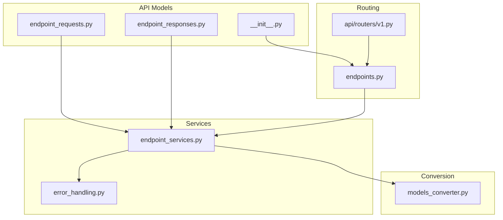
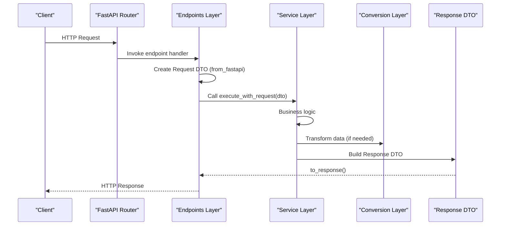
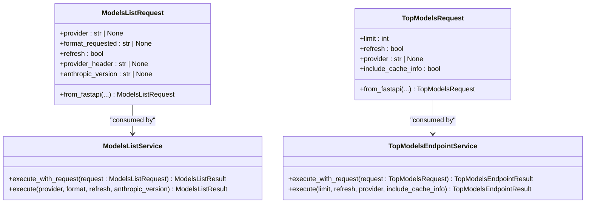
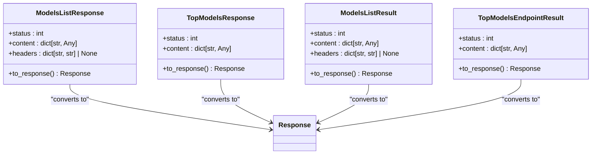
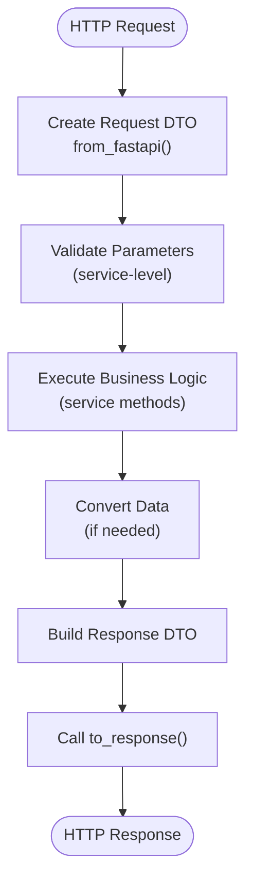
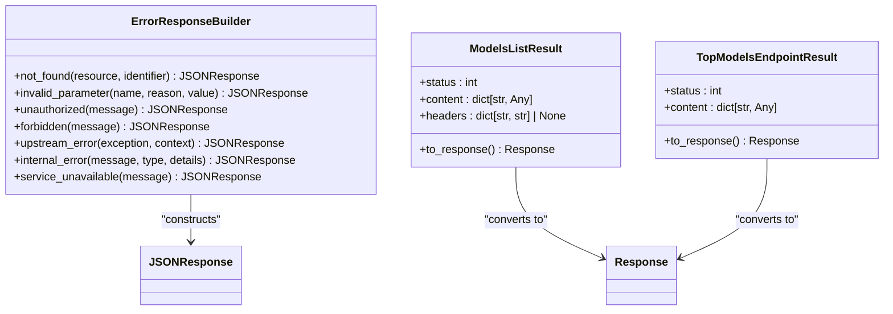
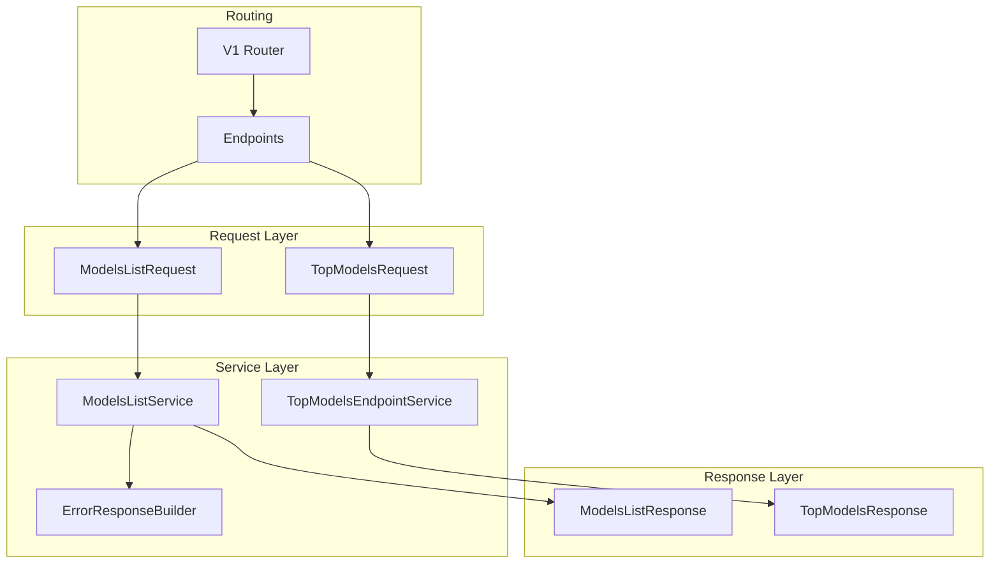

# Data Transfer Object System

<cite>
**Referenced Files in This Document**
- [endpoint_requests.py](file://src/api/models/endpoint_requests.py)
- [endpoint_responses.py](file://src/api/models/endpoint_responses.py)
- [__init__.py](file://src/api/models/__init__.py)
- [endpoint_services.py](file://src/api/services/endpoint_services.py)
- [endpoints.py](file://src/api/endpoints.py)
- [models_converter.py](file://src/conversion/models_converter.py)
- [error_handling.py](file://src/api/services/error_handling.py)
</cite>

## Table of Contents
1. [Introduction](#introduction)
2. [Project Structure](#project-structure)
3. [Core Components](#core-components)
4. [Architecture Overview](#architecture-overview)
5. [Detailed Component Analysis](#detailed-component-analysis)
6. [Dependency Analysis](#dependency-analysis)
7. [Performance Considerations](#performance-considerations)
8. [Troubleshooting Guide](#troubleshooting-guide)
9. [Conclusion](#conclusion)

## Introduction
This document describes the Data Transfer Object (DTO) System that provides type-safe request and response structures for the API endpoints. The system separates HTTP-layer concerns from business logic by introducing immutable, frozen dataclasses that carry endpoint parameters and structured results. This enables cleaner dependency injection, improved testability, and consistent error handling across the application.

## Project Structure
The DTO system is organized under the API models package and integrates with service layer components and FastAPI routing:

**Diagram sources**
- [endpoint_requests.py](file://src/api/models/endpoint_requests.py#L1-L116)
- [endpoint_responses.py](file://src/api/models/endpoint_responses.py#L1-L42)
- [__init__.py](file://src/api/models/__init__.py#L1-L22)
- [endpoint_services.py](file://src/api/services/endpoint_services.py#L1-L862)
- [endpoints.py](file://src/api/endpoints.py#L1-L478)
- [models_converter.py](file://src/conversion/models_converter.py#L1-L71)
- [error_handling.py](file://src/api/services/error_handling.py#L1-L299)

**Section sources**
- [endpoint_requests.py](file://src/api/models/endpoint_requests.py#L1-L116)
- [endpoint_responses.py](file://src/api/models/endpoint_responses.py#L1-L42)
- [__init__.py](file://src/api/models/__init__.py#L1-L22)
- [endpoint_services.py](file://src/api/services/endpoint_services.py#L1-L862)
- [endpoints.py](file://src/api/endpoints.py#L1-L478)

## Core Components
The DTO system consists of two primary categories:

- Request DTOs: Encapsulate endpoint parameters and headers for type-safe consumption by services
- Response DTOs: Provide structured results that convert to FastAPI responses consistently

Key characteristics:
- Immutable dataclasses with frozen=True and slots=True for memory efficiency
- Explicit type annotations for all fields
- Class methods for FastAPI dependency injection (from_fastapi)
- Dedicated service result types mirroring response DTOs for business logic

**Section sources**
- [endpoint_requests.py](file://src/api/models/endpoint_requests.py#L12-L116)
- [endpoint_responses.py](file://src/api/models/endpoint_responses.py#L13-L42)
- [endpoint_services.py](file://src/api/services/endpoint_services.py#L36-L96)

## Architecture Overview
The DTO system follows a layered architecture with clear boundaries:

**Diagram sources**
- [endpoints.py](file://src/api/endpoints.py#L407-L452)
- [endpoint_requests.py](file://src/api/models/endpoint_requests.py#L26-L115)
- [endpoint_services.py](file://src/api/services/endpoint_services.py#L164-L861)
- [models_converter.py](file://src/conversion/models_converter.py#L14-L71)
- [endpoint_responses.py](file://src/api/models/endpoint_responses.py#L21-L41)

## Detailed Component Analysis

### Request DTOs: ModelsListRequest and TopModelsRequest
Request DTOs encapsulate endpoint parameters and headers, enabling dependency injection from FastAPI:

**Diagram sources**
- [endpoint_requests.py](file://src/api/models/endpoint_requests.py#L12-L116)
- [endpoint_services.py](file://src/api/services/endpoint_services.py#L98-L861)

Implementation highlights:
- FastAPI Query and Header annotations define parameter extraction
- from_fastapi classmethods enable direct dependency injection
- Fields preserve original parameter semantics (e.g., format vs. format_requested)
- Validation constraints are enforced at the service level

**Section sources**
- [endpoint_requests.py](file://src/api/models/endpoint_requests.py#L12-L116)
- [endpoint_services.py](file://src/api/services/endpoint_services.py#L164-L861)

### Response DTOs: ModelsListResponse and TopModelsResponse
Response DTOs provide structured results that convert to FastAPI responses:

**Diagram sources**
- [endpoint_responses.py](file://src/api/models/endpoint_responses.py#L13-L42)
- [endpoint_services.py](file://src/api/services/endpoint_services.py#L36-L96)

Design principles:
- Frozen dataclasses ensure immutability and predictable behavior
- Optional headers support specialized response scenarios
- Unified to_response() methods abstract FastAPI response creation

**Section sources**
- [endpoint_responses.py](file://src/api/models/endpoint_responses.py#L13-L42)
- [endpoint_services.py](file://src/api/services/endpoint_services.py#L36-L96)

### Integration in Endpoints and Services
The DTO system integrates seamlessly with FastAPI routing and service execution:

**Diagram sources**
- [endpoints.py](file://src/api/endpoints.py#L407-L452)
- [endpoint_requests.py](file://src/api/models/endpoint_requests.py#L26-L115)
- [endpoint_services.py](file://src/api/services/endpoint_services.py#L164-L861)
- [models_converter.py](file://src/conversion/models_converter.py#L14-L71)

Key integration points:
- Endpoints use Depends with from_fastapi to construct DTOs
- Services expose execute_with_request methods for clean parameter consumption
- Response DTOs unify response construction across endpoints

**Section sources**
- [endpoints.py](file://src/api/endpoints.py#L407-L452)
- [endpoint_services.py](file://src/api/services/endpoint_services.py#L164-L861)

### Error Handling and Consistency
The system maintains consistent error handling through dedicated builders and result types:

**Diagram sources**
- [error_handling.py](file://src/api/services/error_handling.py#L19-L219)
- [endpoint_services.py](file://src/api/services/endpoint_services.py#L36-L96)

**Section sources**
- [error_handling.py](file://src/api/services/error_handling.py#L19-L219)
- [endpoint_services.py](file://src/api/services/endpoint_services.py#L36-L96)

## Dependency Analysis
The DTO system exhibits low coupling and high cohesion:

**Diagram sources**
- [endpoint_requests.py](file://src/api/models/endpoint_requests.py#L12-L116)
- [endpoint_responses.py](file://src/api/models/endpoint_responses.py#L13-L42)
- [endpoint_services.py](file://src/api/services/endpoint_services.py#L98-L861)
- [endpoints.py](file://src/api/endpoints.py#L407-L452)
- [error_handling.py](file://src/api/services/error_handling.py#L19-L219)

**Section sources**
- [endpoint_requests.py](file://src/api/models/endpoint_requests.py#L12-L116)
- [endpoint_responses.py](file://src/api/models/endpoint_responses.py#L13-L42)
- [endpoint_services.py](file://src/api/services/endpoint_services.py#L98-L861)
- [endpoints.py](file://src/api/endpoints.py#L407-L452)

## Performance Considerations
- Memory efficiency: frozen dataclasses with slots reduce memory overhead
- Immutability: prevents accidental mutation and supports safe sharing across threads
- Type safety: catches parameter mismatches at development time
- Conversion optimization: centralized conversion functions minimize repeated transformations

## Troubleshooting Guide
Common issues and resolutions:

**Parameter Validation Failures**
- Symptom: 400 Bad Request responses
- Cause: Invalid parameter values or types
- Resolution: Verify parameter constraints in from_fastapi methods

**Provider Resolution Issues**
- Symptom: 404 Not Found for providers
- Cause: Unknown provider names
- Resolution: Check provider configuration and availability

**Format Conversion Problems**
- Symptom: Unexpected response format
- Cause: Incorrect format inference
- Resolution: Verify anthropic-version header and format parameters

**Section sources**
- [endpoint_requests.py](file://src/api/models/endpoint_requests.py#L26-L115)
- [endpoint_services.py](file://src/api/services/endpoint_services.py#L189-L210)
- [error_handling.py](file://src/api/services/error_handling.py#L36-L83)

## Conclusion
The DTO System successfully decouples HTTP-layer concerns from business logic through type-safe data containers. It improves maintainability, testability, and consistency across endpoints while preserving the flexibility needed for diverse provider integrations. The system's design supports future enhancements and provides a solid foundation for API evolution.