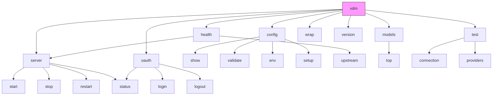
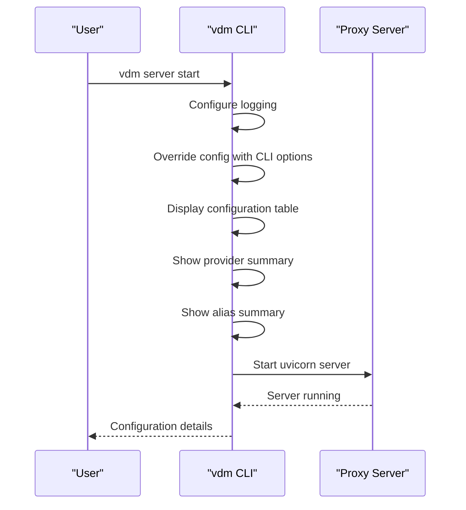
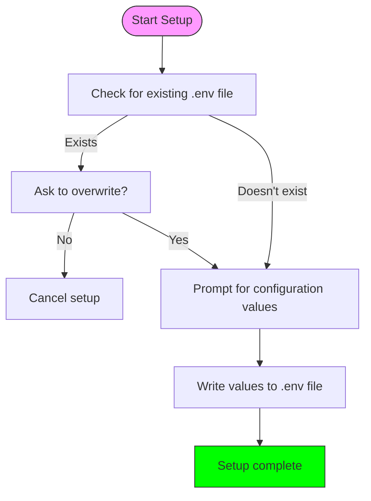
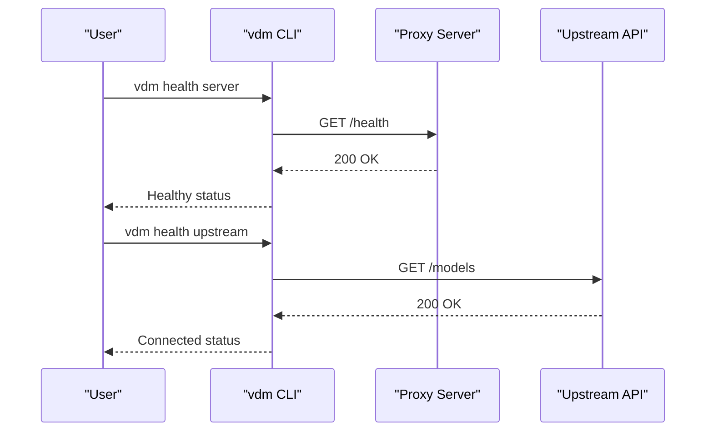
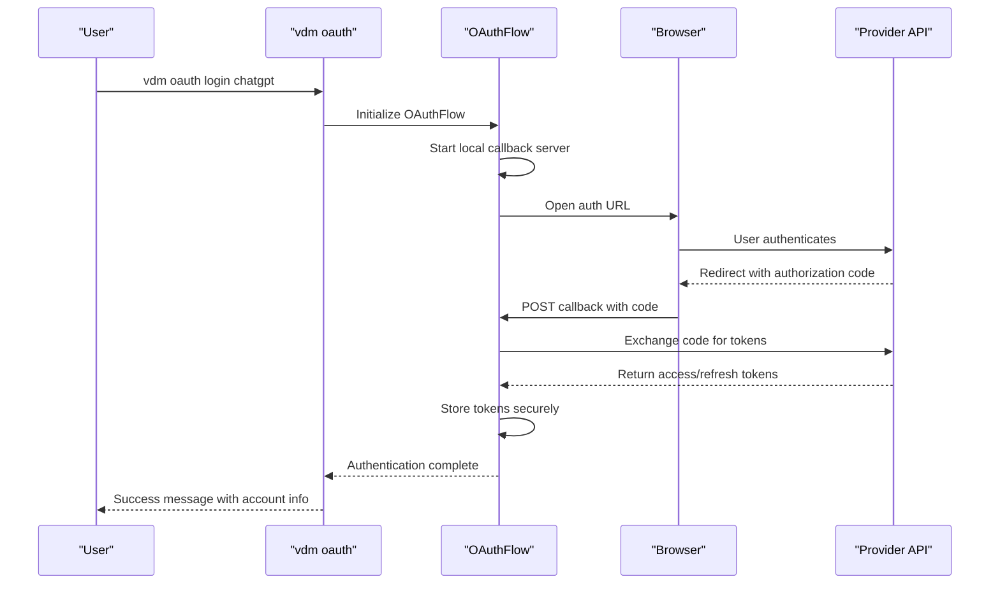
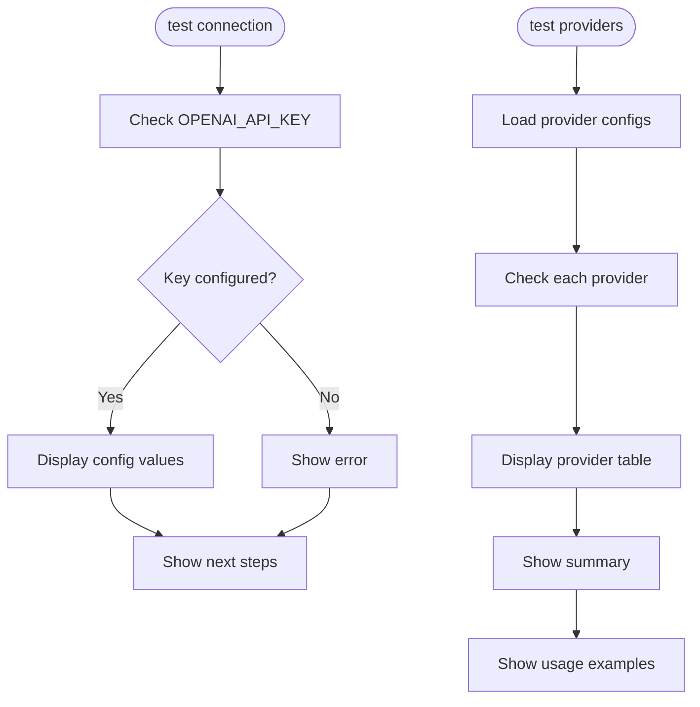
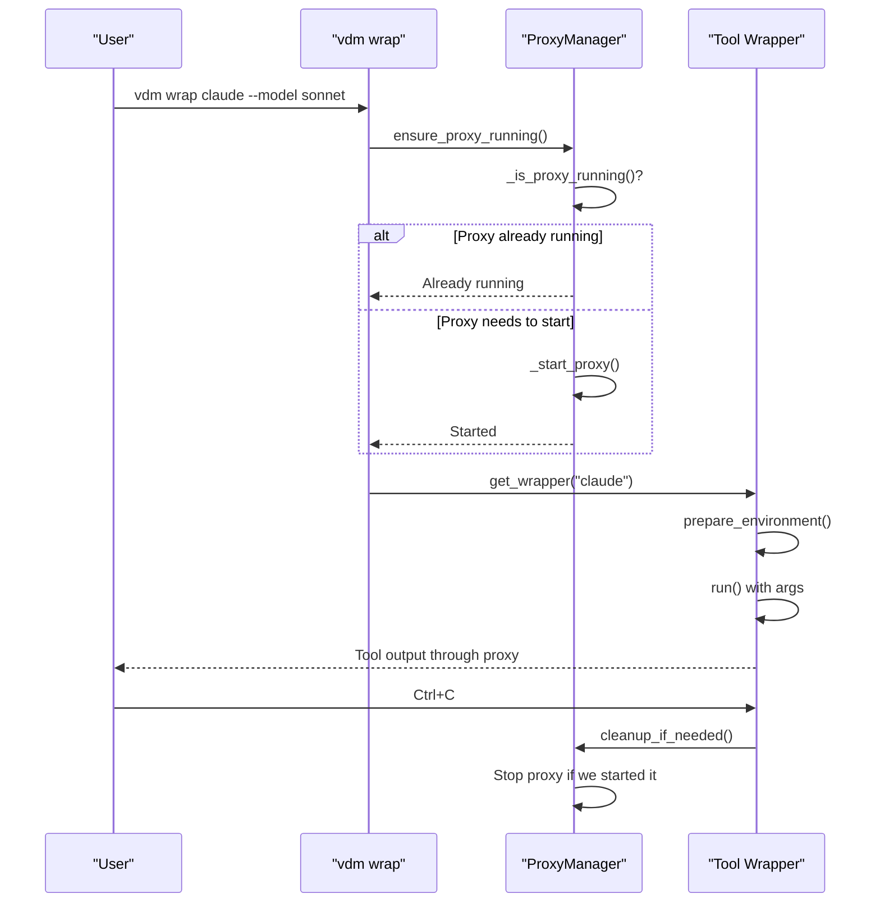
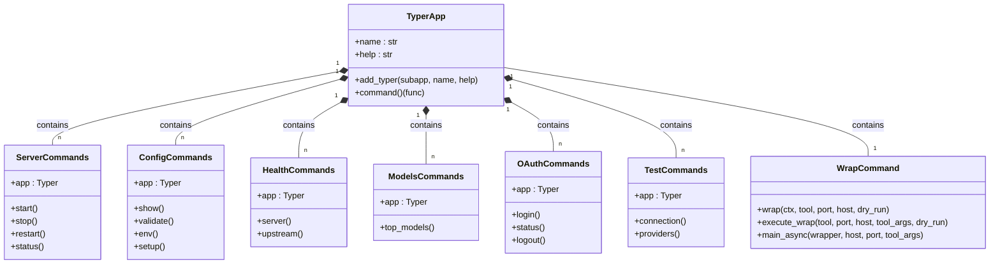
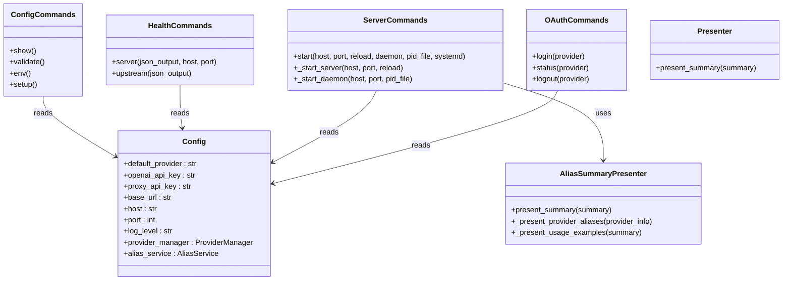

# CLI Tool Reference

<cite>
**Referenced Files in This Document**
- [src/cli/main.py](file://src/cli/main.py)
- [src/cli/commands/server.py](file://src/cli/commands/server.py)
- [src/cli/commands/config.py](file://src/cli/commands/config.py)
- [src/cli/commands/health.py](file://src/cli/commands/health.py)
- [src/cli/commands/models.py](file://src/cli/commands/models.py)
- [src/cli/commands/oauth.py](file://src/cli/commands/oauth.py)
- [src/cli/commands/test.py](file://src/cli/commands/test.py)
- [src/cli/commands/wrap.py](file://src/cli/commands/wrap.py)
- [src/cli/wrap/proxy_manager.py](file://src/cli/wrap/proxy_manager.py)
- [src/cli/wrap/wrappers.py](file://src/cli/wrap/wrappers.py)
- [src/cli/presenters/aliases.py](file://src/cli/presenters/aliases.py)
- [src/core/config.py](file://src/core/config.py)
- [src/core/oauth/__init__.py](file://src/core/oauth/__init__.py)
- [src/core/oauth/oauth.py](file://src/core/oauth/oauth.py)
- [src/core/oauth_client_mixin.py](file://src/core/oauth_client_mixin.py)
- [docs/oauth-guide.md](file://docs/oauth-guide.md)
</cite>

## Update Summary
**Changes Made**
- Added comprehensive OAuth command documentation with login, status, and logout functionality
- Updated command structure diagram to include OAuth commands
- Added OAuth authentication flow integration details
- Updated CLI architecture to reflect new OAuth command registration
- Enhanced troubleshooting section with OAuth-specific guidance

## Table of Contents
1. [Introduction](#introduction)
2. [Command Structure](#command-structure)
3. [Server Management](#server-management)
4. [Configuration Management](#configuration-management)
5. [Health Checks](#health-checks)
6. [Model Discovery](#model-discovery)
7. [OAuth Authentication](#oauth-authentication)
8. [Testing Utilities](#testing-utilities)
9. [Wrap Command](#wrap-command)
10. [CLI Architecture](#cli-architecture)
11. [Troubleshooting](#troubleshooting)

## Introduction
The Vandamme Proxy CLI (vdm) provides comprehensive command-line tools for managing the proxy server, inspecting configuration, performing health checks, discovering models, authenticating with OAuth providers, and testing connectivity. The CLI is designed to be intuitive and powerful, offering both simple commands for common tasks and advanced options for detailed server administration. This document serves as a complete reference for developers and operators who manage the proxy through the command line.

## Command Structure
The vdm CLI follows a hierarchical command structure with subcommands organized by functionality. The main command is `vdm`, with subcommands grouped into logical categories:



**Diagram sources**
- [src/cli/main.py](file://src/cli/main.py#L13-L28)

**Section sources**
- [src/cli/main.py](file://src/cli/main.py#L1-L114)

## Server Management
The server command group provides tools for starting, stopping, and managing the proxy server instance.

### Start Command
The `server start` command launches the proxy server with configurable options:

```bash
vdm server start [--host HOST] [--port PORT] [--reload] [--daemon] [--pid-file PID_FILE] [--systemd]
```

Key options:
- `--host`: Override the server host (default: 0.0.0.0)
- `--port`: Override the server port (default: 8082)
- `--reload`: Enable auto-reload for development
- `--daemon`: Run in background mode
- `--pid-file`: Specify PID file path
- `--systemd`: Send logs to systemd journal instead of console

When starting the server, the CLI displays configuration details including server URL, default provider, base URL, and API key hash. It also shows provider and alias summaries to help verify the setup.



**Diagram sources**
- [src/cli/commands/server.py](file://src/cli/commands/server.py#L16-L113)

**Section sources**
- [src/cli/commands/server.py](file://src/cli/commands/server.py#L1-L114)

### Stop, Restart, and Status Commands
The CLI includes commands for stopping, restarting, and checking the status of the server:

```bash
vdm server stop
vdm server restart
vdm server status
```

**Note**: As of the current implementation, the stop, restart, and status commands are not yet implemented and display placeholder messages. These features are planned for future releases.

**Section sources**
- [src/cli/commands/server.py](file://src/cli/commands/server.py#L73-L93)

## Configuration Management
The config command group provides tools for viewing, validating, and setting up configuration.

### Show Command
The `config show` command displays the current configuration with sensitive values masked:

```bash
vdm config show
```

This command shows key configuration variables including API keys (hashed), base URLs, host, port, log level, and request limits. The output is presented in a formatted table for easy reading.

### Validate Command
The `config validate` command checks the configuration for required settings:

```bash
vdm config validate
```

This command verifies that essential configuration values are present and valid, displaying validation errors if any issues are found. It specifically checks for the presence of required API keys.

### Env Command
The `config env` command displays all required and optional environment variables:

```bash
vdm config env
```

This command shows a comprehensive list of environment variables that can be used to configure the proxy, including required variables like OPENAI_API_KEY and optional variables for customizing behavior.

### Setup Command
The `config setup` command provides an interactive configuration setup:

```bash
vdm config setup
```

This command guides users through setting up the proxy by prompting for required values and generating a .env file with the configuration. It checks for existing configuration files and asks for confirmation before overwriting.



**Diagram sources**
- [src/cli/commands/config.py](file://src/cli/commands/config.py#L104-L140)

**Section sources**
- [src/cli/commands/config.py](file://src/cli/commands/config.py#L1-L141)

## Health Checks
The health command group provides tools for checking the health of the proxy server and upstream APIs.

### Server Health Check
The `health server` command checks the proxy server's health:

```bash
vdm health server [--json] [--host HOST] [--port PORT]
```

This command sends a GET request to the `/health` endpoint of the proxy server and displays the response. It can output in either formatted table or JSON format. The check includes response time measurement and connection verification.

### Upstream API Health Check
The `health upstream` command checks connectivity to upstream APIs:

```bash
vdm health upstream [--json]
```

This command tests connectivity to the configured upstream API (e.g., OpenAI) by making a request to list available models. It verifies that the proxy can successfully communicate with the upstream service and that API credentials are valid.



**Diagram sources**
- [src/cli/commands/health.py](file://src/cli/commands/health.py#L17-L125)

**Section sources**
- [src/cli/commands/health.py](file://src/cli/commands/health.py#L1-L126)

## Model Discovery
The models command provides tools for discovering and exploring available models.

### Top Models Command
The `models top` command shows curated top models:

```bash
vdm models top [--base-url BASE_URL] [--limit LIMIT] [--refresh] [--provider PROVIDER] [--sub-provider SUB_PROVIDER] [--json]
```

This command fetches model recommendations from the proxy's `/top-models` endpoint, displaying information such as provider, sub-provider, model ID, context window, pricing, and capabilities. It supports filtering by provider and sub-provider, and can bypass the cache with the `--refresh` option.

The output includes a table of models and suggested aliases that can be used to simplify model references.

**Section sources**
- [src/cli/commands/models.py](file://src/cli/commands/models.py#L1-L88)

## OAuth Authentication
The oauth command group provides comprehensive OAuth authentication management for providers that support OAuth 2.0 with PKCE flow.

### OAuth Login
The `oauth login` command initiates OAuth authentication with a specified provider:

```bash
vdm oauth login chatgpt
```

This command performs the complete OAuth 2.0 + PKCE flow:
1. Creates provider-specific storage directory: `~/.vandamme/oauth/{provider}/`
2. Starts a local callback server for OAuth redirection
3. Opens a browser window for authentication
4. Handles token exchange and secure storage
5. Displays authentication success with account information

**Important Dependencies**: OAuth functionality requires the `oauth` package. Install it with:
```bash
pip install oauth
```

### OAuth Status
The `oauth status` command checks authentication status for a provider:

```bash
vdm oauth status chatgpt
```

This command displays:
- Current authentication status (authenticated/not authenticated)
- Account ID associated with the token
- Token expiration timestamp
- Last refresh timestamp
- Storage path location
- File permissions verification

### OAuth Logout
The `oauth logout` command removes stored OAuth tokens:

```bash
vdm oauth logout chatgpt
```

This command:
1. Removes stored authentication data from `~/.vandamme/oauth/{provider}/auth.json`
2. Clears any cached tokens
3. Confirms successful logout

### OAuth Storage and Security
OAuth tokens are stored securely with the following characteristics:
- **Location**: `~/.vandamme/oauth/{provider}/auth.json`
- **Permissions**: `0600` (read/write for owner only)
- **Format**: JSON containing access_token, refresh_token, id_token, account_id, expires_at, last_refresh
- **Isolation**: Each provider has separate storage directory

### OAuth Flow Architecture


**Diagram sources**
- [src/cli/commands/oauth.py](file://src/cli/commands/oauth.py#L14-L87)
- [src/core/oauth/oauth.py](file://src/core/oauth/oauth.py#L57-L158)

**Section sources**
- [src/cli/commands/oauth.py](file://src/cli/commands/oauth.py#L1-L246)
- [src/core/oauth/__init__.py](file://src/core/oauth/__init__.py#L1-L115)
- [src/core/oauth/oauth.py](file://src/core/oauth/oauth.py#L1-L182)
- [src/core/oauth_client_mixin.py](file://src/core/oauth_client_mixin.py#L1-L70)
- [docs/oauth-guide.md](file://docs/oauth-guide.md#L1-L439)

## Testing Utilities
The test command group provides diagnostic tools for verifying configuration and connectivity.

### Connection Test
The `test connection` command verifies API connectivity:

```bash
vdm test connection
```

This command checks that essential configuration values are set, particularly API keys. It validates that the OPENAI_API_KEY is configured and displays the current configuration values.

### Providers Test
The `test providers` command lists all configured providers:

```bash
vdm test providers
```

This command displays the status of all configured providers, showing which ones are ready for requests and which have configuration issues. It provides a summary of provider readiness and usage examples for model routing.



**Diagram sources**
- [src/cli/commands/test.py](file://src/cli/commands/test.py#L15-L127)

**Section sources**
- [src/cli/commands/test.py](file://src/cli/commands/test.py#L1-L128)

## Wrap Command
The wrap command enables CLI tools to use the VDM proxy without manual configuration.

### Basic Usage
The wrap command intercepts API calls from CLI tools and routes them through the proxy:

```bash
vdm wrap [--port PORT] [--host HOST] [--dry-run] TOOL [TOOL_ARGS]
```

Supported tools include `claude` and `gemini`. The command automatically sets environment variables to redirect the tool's API calls through the proxy.

### Dry Run Mode
The `--dry-run` option shows what would be executed without actually running the command:

```bash
vdm wrap --dry-run claude -- --model sonnet
```

This is useful for understanding the command that would be executed and the environment variables that would be set.

### Automatic Proxy Management
The wrap command automatically manages the proxy lifecycle:



**Diagram sources**
- [src/cli/commands/wrap.py](file://src/cli/commands/wrap.py#L16-L147)
- [src/cli/wrap/proxy_manager.py](file://src/cli/wrap/proxy_manager.py#L14-L141)

**Section sources**
- [src/cli/commands/wrap.py](file://src/cli/commands/wrap.py#L1-L148)
- [src/cli/wrap/proxy_manager.py](file://src/cli/wrap/proxy_manager.py#L1-L142)
- [src/cli/wrap/wrappers.py](file://src/cli/wrap/wrappers.py#L1-L141)

## CLI Architecture
The CLI is built using the Typer framework and follows a modular architecture with commands organized in separate modules.

### Command Registration
Commands are registered in `src/cli/main.py` using Typer's `add_typer` method:



**Diagram sources**
- [src/cli/main.py](file://src/cli/main.py#L13-L28)

**Section sources**
- [src/cli/main.py](file://src/cli/main.py#L1-L114)

### Configuration Integration
The CLI integrates with the core configuration system to access runtime settings:



**Diagram sources**
- [src/core/config.py](file://src/core/config.py#L15-L200)
- [src/cli/presenters/aliases.py](file://src/cli/presenters/aliases.py#L21-L181)

**Section sources**
- [src/core/config.py](file://src/core/config.py#L1-L285)
- [src/cli/presenters/aliases.py](file://src/cli/presenters/aliases.py#L1-L182)

## Troubleshooting
This section provides guidance for common issues encountered when using the CLI.

### Common Issues and Solutions
- **Command not found**: Ensure vandamme-proxy is installed and the `vdm` command is in your PATH
- **Connection errors**: Verify the proxy server is running and accessible at the specified host and port
- **API key errors**: Check that required API keys are set in environment variables
- **Permission issues**: Ensure you have appropriate permissions to write configuration files
- **OAuth import errors**: Install the `oauth` package for OAuth functionality: `pip install oauth`

### OAuth-Specific Troubleshooting
- **Authentication fails**: Check browser availability and try manual authentication flow
- **Token expired**: Use `vdm oauth status` to check token validity and re-authenticate if needed
- **Provider not found**: Verify AUTH_MODE is set correctly and provider is configured
- **File permission errors**: Fix permissions with `chmod 0600 ~/.vandamme/oauth/{provider}/auth.json`

### Debugging Tips
- Use the `--verbose` flag to enable debug-level logging
- Check the `config env` output to verify required environment variables
- Use `test connection` and `test providers` to diagnose configuration issues
- For wrap command issues, use `--dry-run` to see what would be executed
- Enable OAuth debug logging with `LOG_LEVEL=DEBUG vdm server start`

**Section sources**
- [src/cli/main.py](file://src/cli/main.py#L94-L111)
- [src/cli/commands/test.py](file://src/cli/commands/test.py#L15-L127)
- [src/cli/commands/oauth.py](file://src/cli/commands/oauth.py#L68-L87)
- [docs/oauth-guide.md](file://docs/oauth-guide.md#L222-L295)
