# Multi-Provider Support

<cite>
**Referenced Files in This Document**
- [provider_manager.py](file://src/core/provider_manager.py)
- [provider_registry.py](file://src/core/provider/provider_registry.py)
- [client_factory.py](file://src/core/provider/client_factory.py)
- [middleware_manager.py](file://src/core/provider/middleware_manager.py)
- [api_key_rotator.py](file://src/core/provider/api_key_rotator.py)
- [provider_config_loader.py](file://src/core/provider/provider_config_loader.py)
- [default_selector.py](file://src/core/provider/default_selector.py)
- [error_types.py](file://src/core/error_types.py)
- [error_handling.py](file://src/api/services/error_handling.py)
- [provider_config.py](file://src/core/provider_config.py)
- [client.py](file://src/core/client.py)
- [anthropic_client.py](file://src/core/anthropic_client.py)
- [defaults.toml](file://src/config/defaults.toml)
- [alias_config.py](file://src/core/alias_config.py)
- [model_manager.py](file://src/core/model_manager.py)
- [provider_context.py](file://src/api/services/provider_context.py)
- [oauth_client_mixin.py](file://src/core/oauth_client_mixin.py)
- [tokens.py](file://src/core/oauth/tokens.py)
- [oauth.py](file://src/cli/commands/oauth.py)
- [multi-provider.env](file://examples/multi-provider.env)
- [anthropic-direct.env](file://examples/anthropic-direct.env)
- [aws-bedrock.env](file://examples/aws-bedrock.env)
- [google-vertex.env](file://examples/google-vertex.env)
- [test_request_orchestrator_error_paths.py](file://tests/api/orchestrator/test_request_orchestrator_error_paths.py)
- [test_oauth_flow.py](file://tests/integration/test_oauth_flow.py)
- [test_provider_config_oauth.py](file://tests/unit/test_provider_config_oauth.py)
</cite>

## Update Summary
This document has been updated to reflect the enhanced provider system architecture with comprehensive OAuth integration and visual indicators. Key enhancements include:
- OAuth authentication support through OAuthClientMixin for token-based authentication
- Visual indicators (🔐 lock emoji) for OAuth-authenticated providers in provider summaries
- Enhanced provider configuration loading with OAuth mode detection and priority handling
- Comprehensive OAuth integration through TokenManager and per-provider storage
- Improved error handling for OAuth-specific scenarios
- Enhanced client factory with OAuth client creation and caching
- Detailed OAuth CLI commands and status reporting

These improvements enable secure OAuth authentication for providers like ChatGPT while maintaining backward compatibility with traditional API key authentication.

## Table of Contents
1. [Introduction](#introduction)
2. [ProviderManager Architecture](#providermanager-architecture)
3. [Provider Routing Mechanism](#provider-routing-mechanism)
4. [Configuration Management](#configuration-management)
5. [OAuth Authentication System](#oauth-authentication-system)
6. [Factory Pattern and Client Creation](#factory-pattern-and-client-creation)
7. [Hierarchical Configuration Loading](#hierarchical-configuration-loading)
8. [Error Handling and Validation](#error-handling-and-validation)
9. [Performance Considerations](#performance-considerations)
10. [Integration with Alias System](#integration-with-alias-system)
11. [Visual Indicators and Provider Display](#visual-indicators-and-provider-display)
12. [Practical Configuration Examples](#practical-configuration-examples)

## Introduction
The vandamme-proxy multi-provider system now implements a modular architecture centered around a facade ProviderManager coordinating specialized components. This design improves maintainability, testability, and scalability when integrating multiple LLM providers such as OpenAI, Anthropic, Poe, Azure, Gemini, and AWS Bedrock. The system supports explicit routing via 'provider:model' syntax, default provider selection with fallback, and robust configuration loading from environment variables and TOML files. Enhanced OAuth authentication capabilities provide secure token-based authentication for providers like ChatGPT, while visual indicators help users quickly identify OAuth-enabled providers. Improved error handling and middleware management further strengthen reliability and observability.

## ProviderManager Architecture
The ProviderManager remains the central coordinator, but it now delegates responsibilities to dedicated components:
- ProviderRegistry: stores and retrieves provider configurations
- ClientFactory: creates and caches provider clients with OAuth support
- ProviderConfigLoader: loads and merges provider configurations with OAuth detection
- DefaultProviderSelector: selects a valid default provider with fallback
- MiddlewareManager: owns and initializes middleware chains
- ApiKeyRotator: manages round-robin key rotation

**Diagram sources**
- [provider_manager.py](file://src/core/provider_manager.py#L30-L120)
- [provider_registry.py](file://src/core/provider/provider_registry.py#L1-L66)
- [client_factory.py](file://src/core/provider/client_factory.py#L1-L108)
- [provider_config_loader.py](file://src/core/provider/provider_config_loader.py#L1-L251)
- [default_selector.py](file://src/core/provider/default_selector.py#L1-L86)
- [middleware_manager.py](file://src/core/provider/middleware_manager.py#L1-L66)
- [api_key_rotator.py](file://src/core/provider/api_key_rotator.py#L1-L54)
- [oauth_client_mixin.py](file://src/core/oauth_client_mixin.py#L1-L70)

**Section sources**
- [provider_manager.py](file://src/core/provider_manager.py#L30-L120)
- [provider_registry.py](file://src/core/provider/provider_registry.py#L1-L66)
- [client_factory.py](file://src/core/provider/client_factory.py#L1-L108)
- [provider_config_loader.py](file://src/core/provider/provider_config_loader.py#L1-L251)
- [default_selector.py](file://src/core/provider/default_selector.py#L1-L86)
- [middleware_manager.py](file://src/core/provider/middleware_manager.py#L1-L66)
- [api_key_rotator.py](file://src/core/provider/api_key_rotator.py#L1-L54)
- [oauth_client_mixin.py](file://src/core/oauth_client_mixin.py#L1-L70)

## Provider Routing Mechanism
Requests can target a specific provider using the 'provider:model' syntax. When omitted, the default provider is used. The ProviderManager's parse_model_name method extracts the provider and model, delegating to the ProviderRegistry and ProviderConfigLoader for configuration retrieval. The ModelManager and ProviderContext coordinate alias resolution and provider context construction.

**Diagram sources**
- [provider_manager.py](file://src/core/provider_manager.py#L421-L431)
- [model_manager.py](file://src/core/model_manager.py#L19-L91)
- [provider_context.py](file://src/api/services/provider_context.py#L21-L58)

**Section sources**
- [provider_manager.py](file://src/core/provider_manager.py#L421-L431)
- [model_manager.py](file://src/core/model_manager.py#L19-L91)
- [provider_context.py](file://src/api/services/provider_context.py#L21-L58)

## Configuration Management
Provider configurations are loaded from environment variables and merged with TOML defaults. The ProviderConfigLoader scans for {PROVIDER}_API_KEY patterns, resolves base URLs with precedence (environment > TOML > defaults), and applies provider-specific settings like API format, timeouts, retries, and custom headers. The DefaultProviderSelector chooses a valid default provider, falling back to the first available if the configured default is missing. Enhanced OAuth support includes automatic detection of OAuth mode through sentinel values and environment variables.

**Diagram sources**
- [provider_config_loader.py](file://src/core/provider/provider_config_loader.py#L36-L197)
- [default_selector.py](file://src/core/provider/default_selector.py#L33-L86)
- [defaults.toml](file://src/config/defaults.toml#L1-L118)
- [provider_config.py](file://src/core/provider_config.py#L104-L106)

**Section sources**
- [provider_config_loader.py](file://src/core/provider/provider_config_loader.py#L36-L197)
- [default_selector.py](file://src/core/provider/default_selector.py#L33-L86)
- [defaults.toml](file://src/config/defaults.toml#L1-L118)
- [provider_config.py](file://src/core/provider_config.py#L104-L106)

## OAuth Authentication System
The system now supports OAuth 2.0 authentication for providers that require token-based authentication. OAuthClientMixin provides reusable methods for retrieving OAuth tokens and injecting them into request headers. TokenManager handles token storage, refresh, and validation with per-provider storage in ~/.vandamme/oauth/{provider}/. The OAuth flow includes login, status checking, and logout commands through the CLI.

**Diagram sources**
- [oauth_client_mixin.py](file://src/core/oauth_client_mixin.py#L13-L70)
- [tokens.py](file://src/core/oauth/tokens.py#L48-L84)
- [client_factory.py](file://src/core/provider/client_factory.py#L53-L67)

**Section sources**
- [oauth_client_mixin.py](file://src/core/oauth_client_mixin.py#L13-L70)
- [tokens.py](file://src/core/oauth/tokens.py#L48-L84)
- [client_factory.py](file://src/core/provider/client_factory.py#L53-L67)
- [oauth.py](file://src/cli/commands/oauth.py#L113-L147)

## Factory Pattern and Client Creation
The ClientFactory dynamically creates and caches provider clients based on ProviderConfig.api_format. It supports both OpenAI-style and Anthropic-style APIs, passthrough providers, and OAuth-authenticated providers. For OAuth providers, the factory creates TokenManager instances with per-provider storage and injects OAuthClientMixin functionality. Cached clients avoid repeated HTTP connection setup and reduce latency.

**Diagram sources**
- [client_factory.py](file://src/core/provider/client_factory.py#L36-L89)
- [client.py](file://src/core/client.py#L32-L352)
- [anthropic_client.py](file://src/core/anthropic_client.py#L25-L271)
- [oauth_client_mixin.py](file://src/core/oauth_client_mixin.py#L13-L70)

**Section sources**
- [client_factory.py](file://src/core/provider/client_factory.py#L36-L89)
- [client.py](file://src/core/client.py#L32-L352)
- [anthropic_client.py](file://src/core/anthropic_client.py#L25-L271)
- [oauth_client_mixin.py](file://src/core/oauth_client_mixin.py#L13-L70)

## Hierarchical Configuration Loading
The system follows a strict precedence order: environment variables override TOML, which override package defaults. ProviderConfigLoader encapsulates this logic, while ProviderManager integrates it into runtime initialization and middleware setup. OAuth mode detection follows priority order: explicit AUTH_MODE environment variable > sentinel value > TOML configuration.

**Diagram sources**
- [provider_config_loader.py](file://src/core/provider/provider_config_loader.py#L176-L197)
- [provider_manager.py](file://src/core/provider_manager.py#L158-L219)
- [alias_config.py](file://src/core/alias_config.py#L32-L155)
- [defaults.toml](file://src/config/defaults.toml#L10-L16)

**Section sources**
- [provider_config_loader.py](file://src/core/provider/provider_config_loader.py#L176-L197)
- [provider_manager.py](file://src/core/provider_manager.py#L158-L219)
- [alias_config.py](file://src/core/alias_config.py#L32-L155)
- [defaults.toml](file://src/config/defaults.toml#L10-L16)

## Error Handling and Validation
Enhanced error handling uses an ErrorType enum and a centralized ErrorResponseBuilder to produce consistent error responses across endpoints. ProviderConfigLoader and ProviderManager validate configurations and raise descriptive errors for missing or conflicting settings. OAuth-specific error handling includes token refresh failures, authentication errors, and missing OAuth dependencies. Tests cover error paths in orchestrator flows, including unknown providers, invalid models, authentication failures, and middleware exceptions.

**Diagram sources**
- [error_types.py](file://src/core/error_types.py#L1-L48)
- [error_handling.py](file://src/api/services/error_handling.py#L19-L219)
- [provider_config_loader.py](file://src/core/provider/provider_config_loader.py#L103-L197)
- [test_request_orchestrator_error_paths.py](file://tests/api/orchestrator/test_request_orchestrator_error_paths.py#L1-L75)
- [test_provider_config_oauth.py](file://tests/unit/test_provider_config_oauth.py#L107-L133)

**Section sources**
- [error_types.py](file://src/core/error_types.py#L1-L48)
- [error_handling.py](file://src/api/services/error_handling.py#L19-L219)
- [provider_config_loader.py](file://src/core/provider/provider_config_loader.py#L103-L197)
- [test_request_orchestrator_error_paths.py](file://tests/api/orchestrator/test_request_orchestrator_error_paths.py#L1-L75)
- [test_provider_config_oauth.py](file://tests/unit/test_provider_config_oauth.py#L107-L133)

## Performance Considerations
Performance optimizations include:
- Connection pooling and client caching via ClientFactory
- Lazy loading of provider configurations and middleware
- Round-robin API key rotation with process-global locks
- Configurable timeouts and retry limits
- Streaming support with proper cancellation handling
- OAuth token caching and refresh optimization
- Per-provider storage isolation for concurrent operations

**Diagram sources**
- [client_factory.py](file://src/core/provider/client_factory.py#L36-L89)
- [api_key_rotator.py](file://src/core/provider/api_key_rotator.py#L16-L54)
- [client.py](file://src/core/client.py#L53-L86)
- [tokens.py](file://src/core/oauth/tokens.py#L79-L84)

**Section sources**
- [client_factory.py](file://src/core/provider/client_factory.py#L36-L89)
- [api_key_rotator.py](file://src/core/provider/api_key_rotator.py#L16-L54)
- [client.py](file://src/core/client.py#L53-L86)
- [tokens.py](file://src/core/oauth/tokens.py#L79-L84)

## Integration with Alias System
The alias system integrates with the provider routing pipeline. The ModelManager resolves aliases and provider prefixes, then delegates to ProviderManager for configuration retrieval. This enables cross-provider aliasing and consistent model naming across providers. OAuth-authenticated providers work seamlessly with the alias system, maintaining token-based authentication throughout the alias resolution process.

**Diagram sources**
- [model_manager.py](file://src/core/model_manager.py#L19-L91)
- [alias_config.py](file://src/core/alias_config.py#L157-L175)
- [provider_manager.py](file://src/core/provider_manager.py#L421-L431)

**Section sources**
- [model_manager.py](file://src/core/model_manager.py#L19-L91)
- [alias_config.py](file://src/core/alias_config.py#L157-L175)

## Visual Indicators and Provider Display
The system now provides visual indicators for OAuth-authenticated providers in the provider summary display. OAuth providers are marked with a 🔐 lock emoji, making it immediately clear which providers require OAuth authentication. The print_provider_summary method automatically detects OAuth providers and displays the appropriate visual indicator alongside the provider name and base URL.

```mermaid
flowchart TD
A[Provider Summary Display] --> B{Check Provider Type}
B --> |OAuth| C[Display 🔐 Indicator]
B --> |API Key| D[Display Standard Indicator]
B --> |Passthrough| E[Display Passthrough Indicator]
C --> F[Print Provider Line]
D --> F
E --> F
F --> G[Print Legend]
G --> H[" 🔐 = OAuth authentication"]
```

**Diagram sources**
- [provider_manager.py](file://src/core/provider_manager.py#L588-L627)

**Section sources**
- [provider_manager.py](file://src/core/provider_manager.py#L588-L627)

## Practical Configuration Examples
The examples demonstrate multi-provider setups and provider-specific configurations:
- multi-provider.env: Configure multiple providers (OpenAI, Anthropic, AWS Bedrock, Azure)
- anthropic-direct.env: Direct Anthropic access with default provider set to Anthropic
- aws-bedrock.env: AWS Bedrock with Claude models and custom headers
- google-vertex.env: Google Vertex AI with Anthropic models and GCP project settings

OAuth configuration examples include:
- ChatGPT OAuth setup with AUTH_MODE=oauth in environment variables
- OAuth sentinel value (!OAUTH) in API key field for TOML configuration
- Per-provider OAuth storage in ~/.vandamme/oauth/{provider}/ directory

Environment variables commonly used include {PROVIDER}_API_KEY, {PROVIDER}_BASE_URL, {PROVIDER}_API_VERSION, {PROVIDER}_AUTH_MODE, and {PROVIDER}_CUSTOM_HEADER_* for per-provider headers.

**Section sources**
- [multi-provider.env](file://examples/multi-provider.env#L1-L48)
- [anthropic-direct.env](file://examples/anthropic-direct.env#L1-L22)
- [aws-bedrock.env](file://examples/aws-bedrock.env#L1-L32)
- [google-vertex.env](file://examples/google-vertex.env#L1-L32)
- [defaults.toml](file://src/config/defaults.toml#L10-L16)
- [oauth.py](file://src/cli/commands/oauth.py#L113-L147)