# Service Layer Architecture

<cite>
**Referenced Files in This Document**
- [src/api/services/chat_completions_handlers.py](file://src/api/services/chat_completions_handlers.py)
- [src/api/services/endpoint_services.py](file://src/api/services/endpoint_services.py)
- [src/api/services/request_builder.py](file://src/api/services/request_builder.py)
- [src/api/services/provider_context.py](file://src/api/services/provider_context.py)
- [src/api/services/streaming_handlers.py](file://src/api/services/streaming_handlers.py)
- [src/api/services/non_streaming_handlers.py](file://src/api/services/non_streaming_handlers.py)
- [src/api/services/key_rotation.py](file://src/api/services/key_rotation.py)
- [src/api/services/metrics_helper.py](file://src/api/services/metrics_helper.py)
- [src/api/services/error_handling.py](file://src/api/services/error_handling.py)
- [src/api/services/streaming.py](file://src/api/services/streaming.py)
- [src/api/services/alias_service.py](file://src/api/services/alias_service.py)
- [src/api/services/metrics_orchestrator.py](file://src/api/services/metrics_orchestrator.py)
- [src/api/orchestrator/request_orchestrator.py](file://src/api/orchestrator/request_orchestrator.py)
- [src/api/endpoints.py](file://src/api/endpoints.py)
- [src/api/models/endpoint_requests.py](file://src/api/models/endpoint_requests.py)
- [src/api/models/endpoint_responses.py](file://src/api/models/endpoint_responses.py)
</cite>

## Update Summary
**Changes Made**
- Added comprehensive Data Transfer Object (DTO) pattern with typed request/response models
- Enhanced streaming handlers with improved error handling and metrics integration
- Improved request builder patterns with ClaudeMessagesRequest support
- Expanded error handling with centralized ErrorResponseBuilder and comprehensive error classification
- Strengthened metrics orchestration with MetricsContext and structured metrics lifecycle management
- Enhanced provider context resolution with structured ProviderContext dataclass

## Table of Contents
1. [Introduction](#introduction)
2. [Project Structure](#project-structure)
3. [Core Components](#core-components)
4. [Architecture Overview](#architecture-overview)
5. [Detailed Component Analysis](#detailed-component-analysis)
6. [Data Transfer Object Pattern](#data-transfer-object-pattern)
7. [Enhanced Streaming Architecture](#enhanced-streaming-architecture)
8. [Comprehensive Error Handling](#comprehensive-error-handling)
9. [Metrics Orchestration](#metrics-orchestration)
10. [Dependency Analysis](#dependency-analysis)
11. [Performance Considerations](#performance-considerations)
12. [Troubleshooting Guide](#troubleshooting-guide)
13. [Conclusion](#conclusion)

## Introduction
This document explains the Service Layer Architecture of the proxy, focusing on how business logic is encapsulated into cohesive, testable services with modern Python patterns. The architecture has undergone a major refactoring featuring comprehensive Data Transfer Objects, enhanced streaming handlers, improved request builder patterns, and integrated error handling throughout the service layer. The design emphasizes type safety, structured data flow, and consistent behavior across endpoints while maintaining separation of concerns between orchestration, conversion, metrics, error handling, and streaming.

## Project Structure
The service layer now features a robust architecture with dedicated DTOs, enhanced streaming capabilities, and comprehensive error handling. The structure centers around typed request/response models, strategy pattern implementations, and integrated cross-cutting concerns.

```mermaid
graph TB
subgraph "Endpoints"
E1["/v1/chat/completions<br/>src/api/endpoints.py"]
E2["Other endpoints<br/>src/api/endpoints.py"]
end
subgraph "DTO Layer"
DTO1["Endpoint Requests<br/>src/api/models/endpoint_requests.py"]
DTO2["Endpoint Responses<br/>src/api/models/endpoint_responses.py"]
end
subgraph "Orchestration"
O1["RequestOrchestrator<br/>src/api/orchestrator/request_orchestrator.py"]
end
subgraph "Services"
S1["ChatCompletionsHandlers<br/>src/api/services/chat_completions_handlers.py"]
S2["EndpointServices<br/>src/api/services/endpoint_services.py"]
S3["StreamingHandlers<br/>src/api/services/streaming_handlers.py"]
S4["NonStreamingHandlers<br/>src/api/services/non_streaming_handlers.py"]
S5["KeyRotation<br/>src/api/services/key_rotation.py"]
S6["MetricsHelper<br/>src/api/services/metrics_helper.py"]
S7["ErrorHandling<br/>src/api/services/error_handling.py"]
S8["StreamingUtility<br/>src/api/services/streaming.py"]
S9["ProviderContext<br/>src/api/services/provider_context.py"]
S10["RequestBuilder<br/>src/api/services/request_builder.py"]
S11["AliasService<br/>src/api/services/alias_service.py"]
S12["MetricsOrchestrator<br/>src/api/services/metrics_orchestrator.py"]
end
E1 --> DTO1
E1 --> O1
E1 --> S1
E1 --> S12
E1 --> S9
E1 --> S10
E1 --> S5
E1 --> S6
E1 --> S8
E1 --> S7
E2 --> S2
E2 --> S11
```

**Diagram sources**
- [src/api/endpoints.py](file://src/api/endpoints.py#L117-L200)
- [src/api/orchestrator/request_orchestrator.py](file://src/api/orchestrator/request_orchestrator.py#L27-L178)
- [src/api/models/endpoint_requests.py](file://src/api/models/endpoint_requests.py#L12-L116)
- [src/api/models/endpoint_responses.py](file://src/api/models/endpoint_responses.py#L13-L42)
- [src/api/services/chat_completions_handlers.py](file://src/api/services/chat_completions_handlers.py#L17-L246)
- [src/api/services/endpoint_services.py](file://src/api/services/endpoint_services.py#L94-L800)
- [src/api/services/streaming_handlers.py](file://src/api/services/streaming_handlers.py#L35-L225)
- [src/api/services/non_streaming_handlers.py](file://src/api/services/non_streaming_handlers.py#L30-L270)
- [src/api/services/key_rotation.py](file://src/api/services/key_rotation.py#L14-L88)
- [src/api/services/metrics_helper.py](file://src/api/services/metrics_helper.py#L14-L78)
- [src/api/services/error_handling.py](file://src/api/services/error_handling.py#L19-L299)
- [src/api/services/streaming.py](file://src/api/services/streaming.py#L19-L248)
- [src/api/services/provider_context.py](file://src/api/services/provider_context.py#L15-L69)
- [src/api/services/request_builder.py](file://src/api/services/request_builder.py#L15-L39)
- [src/api/services/alias_service.py](file://src/api/services/alias_service.py#L65-L211)
- [src/api/services/metrics_orchestrator.py](file://src/api/services/metrics_orchestrator.py#L36-L283)

**Section sources**
- [src/api/endpoints.py](file://src/api/endpoints.py#L117-L200)
- [src/api/models/endpoint_requests.py](file://src/api/models/endpoint_requests.py#L12-L116)
- [src/api/models/endpoint_responses.py](file://src/api/models/endpoint_responses.py#L13-L42)
- [src/api/services/chat_completions_handlers.py](file://src/api/services/chat_completions_handlers.py#L17-L246)
- [src/api/services/endpoint_services.py](file://src/api/services/endpoint_services.py#L94-L800)
- [src/api/services/streaming_handlers.py](file://src/api/services/streaming_handlers.py#L35-L225)
- [src/api/services/non_streaming_handlers.py](file://src/api/services/non_streaming_handlers.py#L30-L270)
- [src/api/services/key_rotation.py](file://src/api/services/key_rotation.py#L14-L88)
- [src/api/services/metrics_helper.py](file://src/api/services/metrics_helper.py#L14-L78)
- [src/api/services/error_handling.py](file://src/api/services/error_handling.py#L19-L299)
- [src/api/services/streaming.py](file://src/api/services/streaming.py#L19-L248)
- [src/api/services/provider_context.py](file://src/api/services/provider_context.py#L15-L69)
- [src/api/services/request_builder.py](file://src/api/services/request_builder.py#L15-L39)
- [src/api/services/alias_service.py](file://src/api/services/alias_service.py#L65-L211)
- [src/api/services/metrics_orchestrator.py](file://src/api/services/metrics_orchestrator.py#L36-L283)
- [src/api/orchestrator/request_orchestrator.py](file://src/api/orchestrator/request_orchestrator.py#L27-L178)

## Core Components
The service layer now features several key architectural improvements:

### Enhanced Strategy Pattern Implementation
- **ChatCompletionsHandlers**: Abstract base class with concrete implementations for Anthropic and OpenAI formats
- **StreamingHandlers**: Comprehensive streaming logic with error handling and metrics integration
- **NonStreamingHandlers**: Robust non-streaming processing with middleware support and error detection

### Data Transfer Object Pattern
- **Typed Request DTOs**: Structured request parameters with FastAPI dependency injection support
- **Response DTOs**: Consistent response structures with automatic conversion to FastAPI responses
- **ProviderContext**: Structured provider resolution context with type safety

### Integrated Cross-Cutting Concerns
- **MetricsOrchestrator**: Centralized metrics lifecycle management with structured context
- **ErrorResponseBuilder**: Comprehensive error response construction with classification
- **Enhanced KeyRotation**: Dynamic API key management with rotation support
- **Improved Streaming**: Advanced SSE error handling with standardized event formatting

**Section sources**
- [src/api/services/chat_completions_handlers.py](file://src/api/services/chat_completions_handlers.py#L17-L246)
- [src/api/services/streaming_handlers.py](file://src/api/services/streaming_handlers.py#L35-L225)
- [src/api/services/non_streaming_handlers.py](file://src/api/services/non_streaming_handlers.py#L30-L270)
- [src/api/services/endpoint_services.py](file://src/api/services/endpoint_services.py#L94-L800)
- [src/api/services/provider_context.py](file://src/api/services/provider_context.py#L15-L69)
- [src/api/services/request_builder.py](file://src/api/services/request_builder.py#L15-L39)
- [src/api/services/key_rotation.py](file://src/api/services/key_rotation.py#L14-L88)
- [src/api/services/metrics_helper.py](file://src/api/services/metrics_helper.py#L14-L78)
- [src/api/services/error_handling.py](file://src/api/services/error_handling.py#L19-L299)
- [src/api/services/streaming.py](file://src/api/services/streaming.py#L19-L248)
- [src/api/services/metrics_orchestrator.py](file://src/api/services/metrics_orchestrator.py#L36-L283)

## Architecture Overview
The refactored service layer follows a modern layered design with comprehensive type safety and structured data flow:

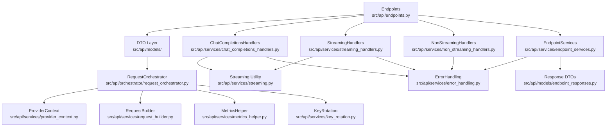

**Diagram sources**
- [src/api/endpoints.py](file://src/api/endpoints.py#L117-L200)
- [src/api/models/endpoint_requests.py](file://src/api/models/endpoint_requests.py#L12-L116)
- [src/api/models/endpoint_responses.py](file://src/api/models/endpoint_responses.py#L13-L42)
- [src/api/orchestrator/request_orchestrator.py](file://src/api/orchestrator/request_orchestrator.py#L27-L178)
- [src/api/services/provider_context.py](file://src/api/services/provider_context.py#L15-L69)
- [src/api/services/request_builder.py](file://src/api/services/request_builder.py#L15-L39)
- [src/api/services/metrics_helper.py](file://src/api/services/metrics_helper.py#L14-L78)
- [src/api/services/key_rotation.py](file://src/api/services/key_rotation.py#L14-L88)
- [src/api/services/chat_completions_handlers.py](file://src/api/services/chat_completions_handlers.py#L17-L246)
- [src/api/services/streaming_handlers.py](file://src/api/services/streaming_handlers.py#L35-L225)
- [src/api/services/non_streaming_handlers.py](file://src/api/services/non_streaming_handlers.py#L30-L270)
- [src/api/services/streaming.py](file://src/api/services/streaming.py#L19-L248)
- [src/api/services/error_handling.py](file://src/api/services/error_handling.py#L19-L299)
- [src/api/services/endpoint_services.py](file://src/api/services/endpoint_services.py#L94-L800)

## Detailed Component Analysis

### Strategy Pattern: Enhanced Chat Completions Handlers
The chat completions handlers now feature improved type safety and structured parameter passing:

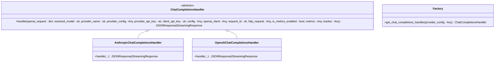

**Diagram sources**
- [src/api/services/chat_completions_handlers.py](file://src/api/services/chat_completions_handlers.py#L17-L246)

**Section sources**
- [src/api/services/chat_completions_handlers.py](file://src/api/services/chat_completions_handlers.py#L17-L246)

### Strategy Pattern: Enhanced Streaming Handlers
The streaming handlers now incorporate comprehensive error handling and metrics integration:

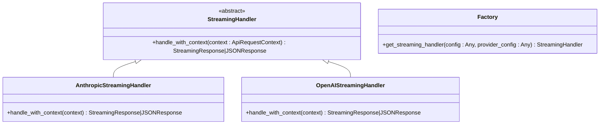

**Diagram sources**
- [src/api/services/streaming_handlers.py](file://src/api/services/streaming_handlers.py#L35-L225)

**Section sources**
- [src/api/services/streaming_handlers.py](file://src/api/services/streaming_handlers.py#L35-L225)

### Strategy Pattern: Enhanced Non-Streaming Handlers
The non-streaming handlers now feature improved error detection and middleware support:

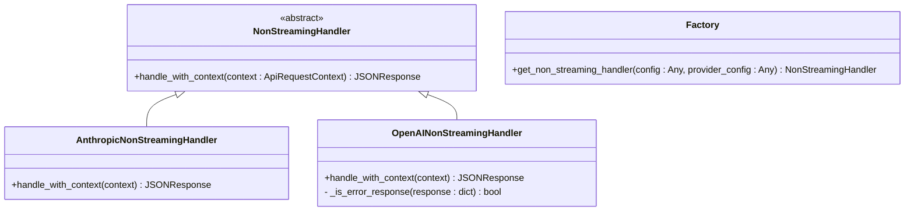

**Diagram sources**
- [src/api/services/non_streaming_handlers.py](file://src/api/services/non_streaming_handlers.py#L30-L270)

**Section sources**
- [src/api/services/non_streaming_handlers.py](file://src/api/services/non_streaming_handlers.py#L30-L270)

### Endpoint Services: Enhanced Business Logic
The endpoint services now utilize structured DTOs and comprehensive result types:

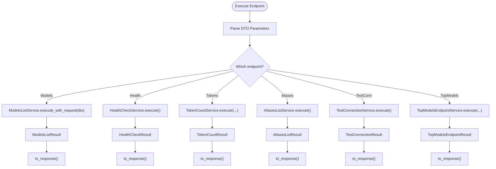

**Diagram sources**
- [src/api/services/endpoint_services.py](file://src/api/services/endpoint_services.py#L94-L800)
- [src/api/models/endpoint_requests.py](file://src/api/models/endpoint_requests.py#L12-L116)
- [src/api/models/endpoint_responses.py](file://src/api/models/endpoint_responses.py#L13-L42)

**Section sources**
- [src/api/services/endpoint_services.py](file://src/api/services/endpoint_services.py#L94-L800)
- [src/api/models/endpoint_requests.py](file://src/api/models/endpoint_requests.py#L12-L116)
- [src/api/models/endpoint_responses.py](file://src/api/models/endpoint_responses.py#L13-L42)

## Data Transfer Object Pattern
The service layer now implements a comprehensive DTO pattern for type-safe data exchange:

### Request DTOs
- **ModelsListRequest**: Encapsulates all model listing parameters with FastAPI dependency injection
- **TopModelsRequest**: Structured parameters for curated model retrieval
- Automatic validation and type conversion through dataclasses

### Response DTOs  
- **ModelsListResponse**: Structured model listing responses with optional headers
- **TopModelsResponse**: Consistent response format for top models endpoint
- Automatic conversion to FastAPI Response objects

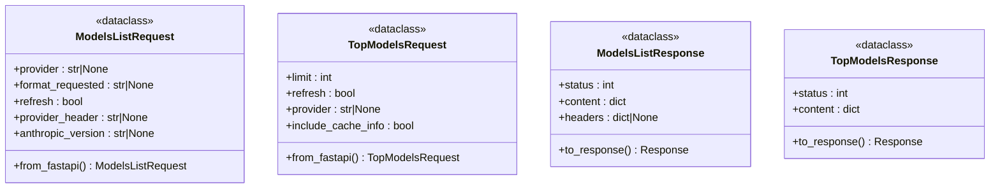

**Diagram sources**
- [src/api/models/endpoint_requests.py](file://src/api/models/endpoint_requests.py#L12-L116)
- [src/api/models/endpoint_responses.py](file://src/api/models/endpoint_responses.py#L13-L42)

**Section sources**
- [src/api/models/endpoint_requests.py](file://src/api/models/endpoint_requests.py#L12-L116)
- [src/api/models/endpoint_responses.py](file://src/api/models/endpoint_responses.py#L13-L42)

## Enhanced Streaming Architecture
The streaming architecture now features comprehensive error handling and metrics integration:

### Streaming Error Handling
- **with_sse_error_handler**: Graceful error handling with standardized SSE events
- **with_streaming_metrics_finalizer**: Automatic metrics cleanup on stream completion
- **with_streaming_error_handling**: Combined error handling and metrics finalization

### SSE Event Formatting
- Standardized error events compatible with OpenAI streaming format
- Support for timeout, HTTP error, and generic streaming errors
- Automatic [DONE] marker emission for clean stream termination

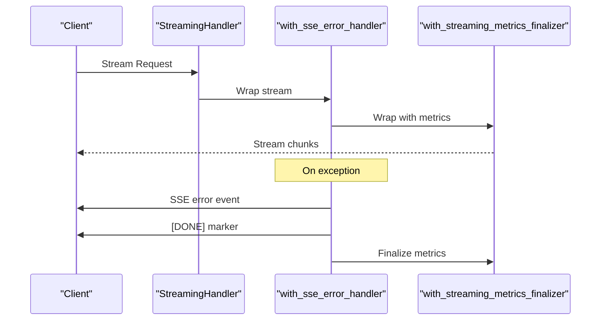

**Diagram sources**
- [src/api/services/streaming.py](file://src/api/services/streaming.py#L108-L248)
- [src/api/services/streaming_handlers.py](file://src/api/services/streaming_handlers.py#L35-L225)

**Section sources**
- [src/api/services/streaming.py](file://src/api/services/streaming.py#L19-L248)
- [src/api/services/streaming_handlers.py](file://src/api/services/streaming_handlers.py#L35-L225)

## Comprehensive Error Handling
The error handling system now provides centralized, type-safe error response construction:

### ErrorResponseBuilder
- **Standardized Error Format**: Consistent error response structure across all endpoints
- **Comprehensive Error Types**: Support for not_found, invalid_parameter, unauthorized, forbidden, upstream_error, internal_error, service_unavailable
- **Automatic Classification**: Error type detection and appropriate HTTP status codes

### Enhanced Streaming Error Handling
- **finalize_metrics_on_streaming_error**: Metrics cleanup on streaming failures
- **build_streaming_error_response**: Standardized error response for streaming contexts
- **Error Type Classification**: Upstream timeout, HTTP error, and generic streaming errors

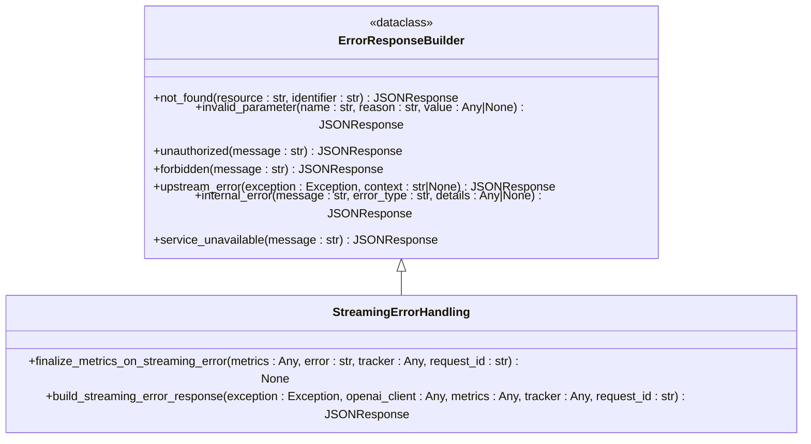

**Diagram sources**
- [src/api/services/error_handling.py](file://src/api/services/error_handling.py#L19-L299)

**Section sources**
- [src/api/services/error_handling.py](file://src/api/services/error_handling.py#L19-L299)

## Metrics Orchestration
The metrics orchestration system now provides comprehensive lifecycle management:

### MetricsContext
- **Structured Context**: Type-safe metrics context with optional metrics objects
- **Provider Resolution Tracking**: Automatic provider and model resolution updates
- **Last Accessed Timestamps**: Provider/model access time tracking

### Enhanced Metrics Lifecycle
- **initialize_request_metrics**: Complete metrics initialization with model resolution
- **update_provider_resolution**: Provider context updates after resolution
- **finalize_on_timeout**: Timeout-specific metrics cleanup
- **finalize_on_error**: Error-specific metrics cleanup
- **finalize_success**: Success metrics cleanup

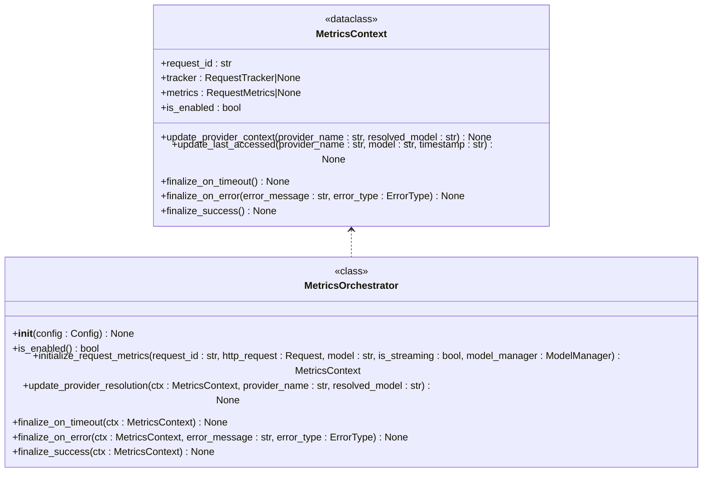

**Diagram sources**
- [src/api/services/metrics_orchestrator.py](file://src/api/services/metrics_orchestrator.py#L34-L283)

**Section sources**
- [src/api/services/metrics_orchestrator.py](file://src/api/services/metrics_orchestrator.py#L34-L283)

## Dependency Analysis
The refactored service layer maintains clean separation of concerns while adding comprehensive type safety:

### Cohesion and Separation of Concerns
- **DTO Layer**: Clean separation of request/response data from business logic
- **Strategy Pattern**: Cohesive format-specific processing with clear interfaces
- **Cross-Cutting Concerns**: Integrated error handling, metrics, and streaming utilities
- **Service Layer**: Independent endpoint logic with structured result types

### Enhanced Coupling Management
- **DTO Integration**: Services consume typed DTOs instead of raw FastAPI dependencies
- **Context Objects**: Structured context passing reduces parameter duplication
- **Factory Patterns**: Centralized handler creation with type-safe configuration
- **Metrics Orchestration**: Unified metrics lifecycle management across all services

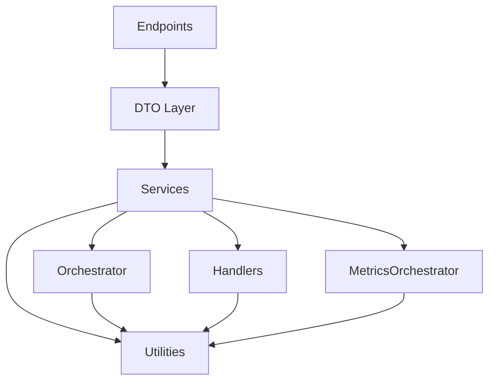

**Diagram sources**
- [src/api/endpoints.py](file://src/api/endpoints.py#L117-L200)
- [src/api/models/endpoint_requests.py](file://src/api/models/endpoint_requests.py#L12-L116)
- [src/api/models/endpoint_responses.py](file://src/api/models/endpoint_responses.py#L13-L42)
- [src/api/services/endpoint_services.py](file://src/api/services/endpoint_services.py#L94-L800)
- [src/api/services/streaming_handlers.py](file://src/api/services/streaming_handlers.py#L35-L225)
- [src/api/services/non_streaming_handlers.py](file://src/api/services/non_streaming_handlers.py#L30-L270)
- [src/api/services/chat_completions_handlers.py](file://src/api/services/chat_completions_handlers.py#L17-L246)
- [src/api/services/streaming.py](file://src/api/services/streaming.py#L19-L248)
- [src/api/services/error_handling.py](file://src/api/services/error_handling.py#L19-L299)
- [src/api/orchestrator/request_orchestrator.py](file://src/api/orchestrator/request_orchestrator.py#L27-L178)
- [src/api/services/metrics_orchestrator.py](file://src/api/services/metrics_orchestrator.py#L34-L283)

**Section sources**
- [src/api/models/endpoint_requests.py](file://src/api/models/endpoint_requests.py#L12-L116)
- [src/api/models/endpoint_responses.py](file://src/api/models/endpoint_responses.py#L13-L42)
- [src/api/services/endpoint_services.py](file://src/api/services/endpoint_services.py#L94-L800)
- [src/api/services/streaming_handlers.py](file://src/api/services/streaming_handlers.py#L35-L225)
- [src/api/services/non_streaming_handlers.py](file://src/api/services/non_streaming_handlers.py#L30-L270)
- [src/api/services/chat_completions_handlers.py](file://src/api/services/chat_completions_handlers.py#L17-L246)
- [src/api/services/streaming.py](file://src/api/services/streaming.py#L19-L248)
- [src/api/services/error_handling.py](file://src/api/services/error_handling.py#L19-L299)
- [src/api/orchestrator/request_orchestrator.py](file://src/api/orchestrator/request_orchestrator.py#L27-L178)
- [src/api/services/metrics_orchestrator.py](file://src/api/services/metrics_orchestrator.py#L34-L283)

## Performance Considerations
The refactored architecture maintains performance while adding comprehensive error handling and metrics:

### Streaming Efficiency Improvements
- **Combined Error Handling**: Single composition of error handling and metrics finalization
- **Structured SSE Events**: Efficient error event formatting with standardized JSON payload
- **Automatic Cleanup**: Finally blocks ensure metrics finalization regardless of stream outcome

### Type Safety Benefits
- **Compile-time Validation**: Dataclasses provide static type checking
- **Reduced Runtime Errors**: Structured DTOs eliminate parameter parsing errors
- **Better IDE Support**: Enhanced autocompletion and error detection

### Metrics Overhead Reduction
- **Centralized Lifecycle**: Single orchestrator manages metrics across all endpoints
- **Optional Metrics**: Graceful degradation when metrics are disabled
- **Structured Context**: Type-safe metrics operations prevent runtime errors

## Troubleshooting Guide
The enhanced error handling provides comprehensive troubleshooting capabilities:

### Streaming Error Resolution
- **SSE Error Events**: Standardized error events with proper JSON formatting
- **Metrics Cleanup**: Automatic metrics finalization on streaming failures
- **Error Classification**: Upstream timeout, HTTP error, and generic streaming errors

### Comprehensive Error Response
- **ErrorResponseBuilder**: Consistent error response format across all endpoints
- **Error Type Detection**: Automatic classification of error types and HTTP status codes
- **Traceback Logging**: Centralized traceback logging for debugging

### Metrics and Diagnostics
- **MetricsContext**: Structured metrics context with optional metrics objects
- **Provider Resolution Tracking**: Automatic provider and model resolution updates
- **Conversation Logging**: Enhanced logging with request-scoped context

**Section sources**
- [src/api/services/streaming.py](file://src/api/services/streaming.py#L108-L248)
- [src/api/services/error_handling.py](file://src/api/services/error_handling.py#L19-L299)
- [src/api/services/metrics_orchestrator.py](file://src/api/services/metrics_orchestrator.py#L34-L283)
- [src/api/services/non_streaming_handlers.py](file://src/api/services/non_streaming_handlers.py#L250-L270)

## Conclusion
The refactored Service Layer Architecture represents a significant advancement in maintainability, type safety, and comprehensive error handling. The introduction of Data Transfer Objects, enhanced streaming handlers, improved request builder patterns, and integrated error handling creates a robust foundation for scalable API development. The architecture maintains clean separation of concerns while providing structured data flow, comprehensive metrics orchestration, and consistent error handling across all service layer components. This design supports multiple providers and formats with minimal duplication, enhanced type safety, and standardized behavior patterns.