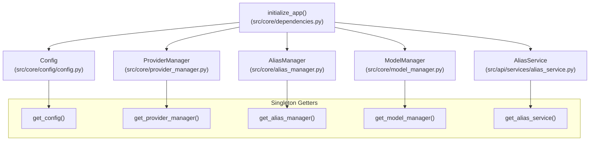
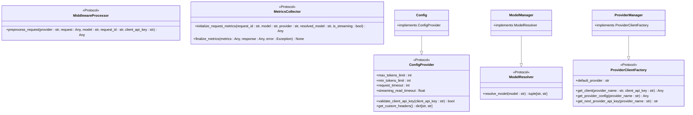
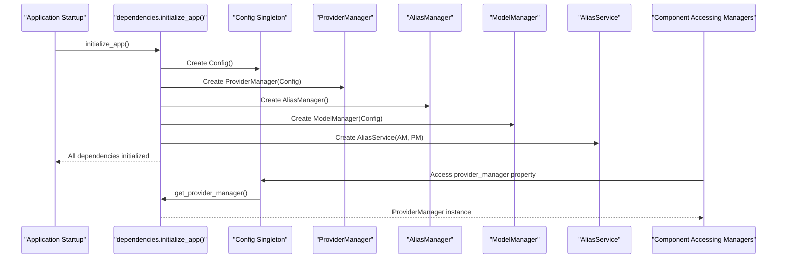
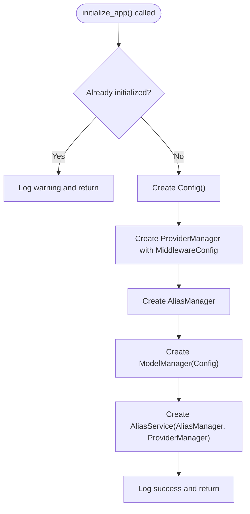
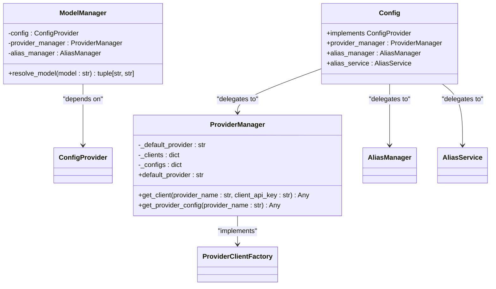
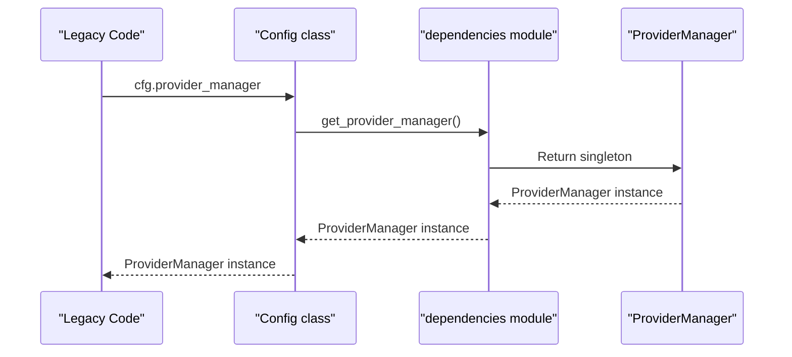
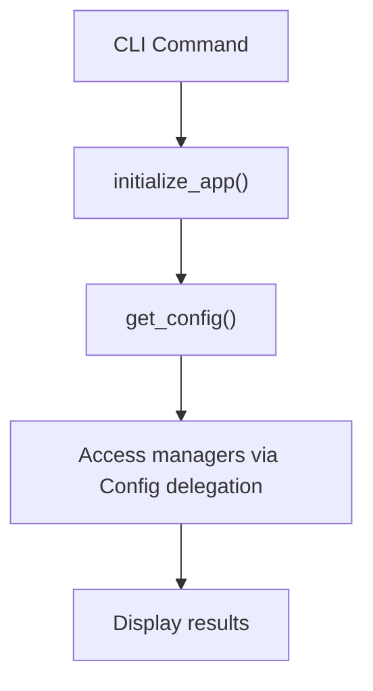
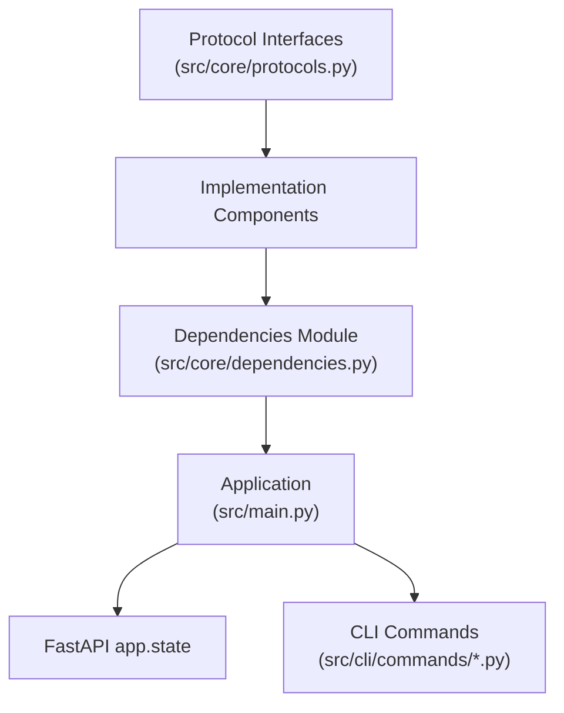

# Dependency Injection System

<cite>
**Referenced Files in This Document**
- [src/main.py](file://src/main.py)
- [src/core/dependencies.py](file://src/core/dependencies.py)
- [src/core/protocols.py](file://src/core/protocols.py)
- [src/core/config/config.py](file://src/core/config/config.py)
- [src/core/model_manager.py](file://src/core/model_manager.py)
- [src/core/provider_manager.py](file://src/core/provider_manager.py)
- [src/api/middleware_runtime.py](file://src/api/middleware_runtime.py)
- [src/core/config/accessors.py](file://src/core/config/accessors.py)
- [src/api/services/alias_service.py](file://src/api/services/alias_service.py)
- [src/cli/commands/server.py](file://src/cli/commands/server.py)
- [src/cli/commands/test.py](file://src/cli/commands/test.py)
</cite>

## Update Summary
**Changes Made**
- Added comprehensive documentation for the new centralized dependency injection system
- Documented protocol-based dependency inversion replacing circular imports
- Updated architecture diagrams to reflect the new dependencies module pattern
- Added new sections covering the dependencies module and protocol system
- Updated troubleshooting guide to address new initialization requirements

## Table of Contents
1. [Introduction](#introduction)
2. [Centralized Dependency Management](#centralized-dependency-management)
3. [Protocol-Based Dependency Inversion](#protocol-based-dependency-inversion)
4. [Core Components](#core-components)
5. [Architecture Overview](#architecture-overview)
6. [Detailed Component Analysis](#detailed-component-analysis)
7. [Initialization System](#initialization-system)
8. [Dependency Analysis](#dependency-analysis)
9. [Performance Considerations](#performance-considerations)
10. [Troubleshooting Guide](#troubleshooting-guide)
11. [Conclusion](#conclusion)

## Introduction
This document explains the new centralized dependency injection system that replaces the previous distributed initialization pattern. The system uses a dedicated dependencies module for centralized singleton initialization and protocol-based dependency inversion to eliminate circular imports while maintaining clean separation of concerns and testability.

## Centralized Dependency Management

The new system introduces a centralized dependencies module that manages all application singletons with explicit initialization order, eliminating the hidden dependencies and circular import problems of the previous architecture.

**Diagram sources**
- [src/core/dependencies.py](file://src/core/dependencies.py#L42-L117)
- [src/core/dependencies.py](file://src/core/dependencies.py#L120-L187)

**Section sources**
- [src/core/dependencies.py](file://src/core/dependencies.py#L1-L188)

## Protocol-Based Dependency Inversion

The system uses PEP 544 Protocol definitions to create clean abstractions that eliminate circular dependencies while maintaining type safety and testability.

**Diagram sources**
- [src/core/protocols.py](file://src/core/protocols.py#L22-L169)
- [src/core/config/config.py](file://src/core/config/config.py#L40-L56)
- [src/core/model_manager.py](file://src/core/model_manager.py#L21-L46)
- [src/core/provider_manager.py](file://src/core/provider_manager.py#L41-L75)

**Section sources**
- [src/core/protocols.py](file://src/core/protocols.py#L1-L169)

## Core Components

### Centralized Dependencies Module
- **initialize_app()**: Orchestrated initialization of all dependencies in the correct order
- **Singleton getters**: Thread-safe accessors for each dependency with runtime validation
- **Module-level storage**: Private variables that hold the initialized singletons

### Protocol Definitions
- **ConfigProvider**: Configuration access interface for all components
- **ModelResolver**: Model name resolution abstraction
- **ProviderClientFactory**: Provider client creation interface
- **MiddlewareProcessor**: Request preprocessing abstraction
- **MetricsCollector**: Metrics collection interface

### Backward Compatibility Layer
- Config class delegates manager access to dependencies module
- Maintains existing API while enabling new initialization pattern

**Section sources**
- [src/core/dependencies.py](file://src/core/dependencies.py#L42-L187)
- [src/core/protocols.py](file://src/core/protocols.py#L22-L169)
- [src/core/config/config.py](file://src/core/config/config.py#L216-L249)

## Architecture Overview

The new architecture eliminates import-time coupling and circular dependencies through explicit initialization and protocol-based abstractions.

**Diagram sources**
- [src/core/dependencies.py](file://src/core/dependencies.py#L42-L117)
- [src/core/config/config.py](file://src/core/config/config.py#L216-L249)

**Section sources**
- [src/core/dependencies.py](file://src/core/dependencies.py#L42-L117)
- [src/core/config/config.py](file://src/core/config/config.py#L216-L249)

## Detailed Component Analysis

### Dependencies Module Implementation

The dependencies module provides a controlled initialization pattern that eliminates circular imports and ensures proper dependency ordering.

**Diagram sources**
- [src/core/dependencies.py](file://src/core/dependencies.py#L42-L117)

**Section sources**
- [src/core/dependencies.py](file://src/core/dependencies.py#L42-L117)

### Protocol Implementation Examples

Components implement protocols rather than importing concrete classes, enabling clean dependency inversion.

**Diagram sources**
- [src/core/model_manager.py](file://src/core/model_manager.py#L21-L46)
- [src/core/provider_manager.py](file://src/core/provider_manager.py#L41-L75)
- [src/core/config/config.py](file://src/core/config/config.py#L216-L249)

**Section sources**
- [src/core/model_manager.py](file://src/core/model_manager.py#L21-L46)
- [src/core/provider_manager.py](file://src/core/provider_manager.py#L41-L75)
- [src/core/config/config.py](file://src/core/config/config.py#L216-L249)

### Backward Compatibility Implementation

The Config class maintains backward compatibility by delegating manager access to the dependencies module while implementing the ConfigProvider protocol.

**Diagram sources**
- [src/core/config/config.py](file://src/core/config/config.py#L216-L249)

**Section sources**
- [src/core/config/config.py](file://src/core/config/config.py#L216-L249)

### CLI Integration Pattern

CLI commands now follow the same initialization pattern as the main application.

**Diagram sources**
- [src/cli/commands/server.py](file://src/cli/commands/server.py#L28-L32)
- [src/cli/commands/test.py](file://src/cli/commands/test.py#L18-L20)

**Section sources**
- [src/cli/commands/server.py](file://src/cli/commands/server.py#L28-L32)
- [src/cli/commands/test.py](file://src/cli/commands/test.py#L18-L20)

## Initialization System

The new initialization system ensures all dependencies are created in the correct order and can be accessed consistently across the application.

### Initialization Order Requirements
1. **Config**: No dependencies, loads all configuration modules
2. **ProviderManager**: Depends on Config for middleware configuration
3. **AliasManager**: No external dependencies
4. **ModelManager**: Depends on Config, ProviderManager, and AliasManager
5. **AliasService**: Depends on AliasManager and ProviderManager

### Runtime Access Patterns
- **FastAPI app.state**: Stores RequestTracker and MiddlewareProcessor
- **Dependencies module**: Stores and provides access to core singletons
- **Config delegation**: Manager properties delegate to dependencies module
- **Context propagation**: Config values accessible via ContextVar in requests

**Section sources**
- [src/core/dependencies.py](file://src/core/dependencies.py#L48-L53)
- [src/main.py](file://src/main.py#L29-L46)
- [src/core/config/accessors.py](file://src/core/config/accessors.py#L35-L48)

## Dependency Analysis

### Circular Import Elimination
- **Before**: Config imported ProviderManager, ProviderManager imported Config
- **After**: Both depend on Protocol interfaces; dependencies module handles instantiation

### Coupling Reduction
- **End-to-end**: Components depend on Protocol interfaces, not concrete implementations
- **Initialization**: All dependencies created in single location with explicit order
- **Backward compatibility**: Existing code continues to work with delegation pattern

### Cohesion Improvements
- **Single responsibility**: Dependencies module manages all singleton lifecycle
- **Protocol isolation**: Each protocol defines a single responsibility boundary
- **Testing benefits**: Easy to mock protocols for unit tests

**Diagram sources**
- [src/core/protocols.py](file://src/core/protocols.py#L1-L169)
- [src/core/dependencies.py](file://src/core/dependencies.py#L1-L188)
- [src/main.py](file://src/main.py#L1-L175)

**Section sources**
- [src/core/protocols.py](file://src/core/protocols.py#L1-L169)
- [src/core/dependencies.py](file://src/core/dependencies.py#L1-L188)
- [src/main.py](file://src/main.py#L1-L175)

## Performance Considerations

### Initialization Performance
- **Single initialization**: Dependencies created once per process, not per request
- **Lazy protocol imports**: TYPE_CHECKING guards prevent import-time overhead
- **Context propagation**: O(1) config access via ContextVar eliminates stack inspection

### Runtime Performance
- **Protocol dispatch**: Minimal overhead compared to concrete class imports
- **Singleton access**: Direct module-level variable access for dependencies
- **Memory efficiency**: Centralized storage prevents duplicate instances

### Testing Benefits
- **Mock protocols**: Easy to substitute test doubles for protocol implementations
- **Isolated components**: Components can be tested independently of others
- **Deterministic behavior**: Controlled initialization ensures predictable test runs

## Troubleshooting Guide

### Common Initialization Issues
- **RuntimeError: Dependencies not initialized**: Call `initialize_app()` before accessing dependencies
- **AttributeError: 'Config' object has no attribute 'provider_manager'**: Missing delegation pattern
- **ImportError: cannot import name 'ProviderManager'**: Circular import prevented by protocol-based design

### Debugging Protocol Issues
- **Mypy errors**: Ensure protocol implementations match interface definitions
- **Runtime type checking**: Use `isinstance()` checks for protocol-conforming objects
- **Missing attributes**: Verify TYPE_CHECKING guards for conditional imports

### Migration from Old Pattern
- **Find all `from src.core.config import Config` imports**: Replace with dependency access
- **Locate direct manager instantiations**: Convert to dependency delegation
- **Update CLI commands**: Add `initialize_app()` calls before config access

**Section sources**
- [src/core/dependencies.py](file://src/core/dependencies.py#L129-L131)
- [src/core/config/config.py](file://src/core/config/config.py#L224-L227)
- [src/cli/commands/server.py](file://src/cli/commands/server.py#L28-L32)

## Conclusion

The new dependency injection system represents a fundamental architectural improvement that eliminates circular imports, reduces complexity, and improves maintainability. The centralized dependencies module with protocol-based dependency inversion provides a clean foundation for future development while maintaining backward compatibility. This system enables better testing, clearer separation of concerns, and more predictable initialization patterns across all application entry points.

The protocol interfaces ensure that components depend on abstractions rather than concrete implementations, making the codebase more modular and easier to extend. The centralized initialization pattern guarantees proper dependency ordering and eliminates the hidden dependencies that caused issues in the previous architecture.