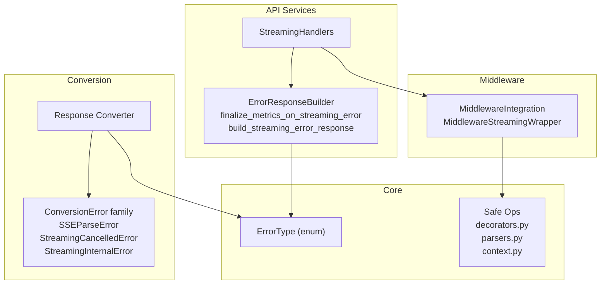
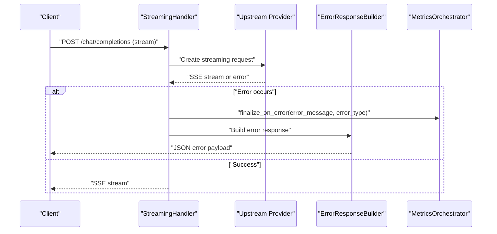
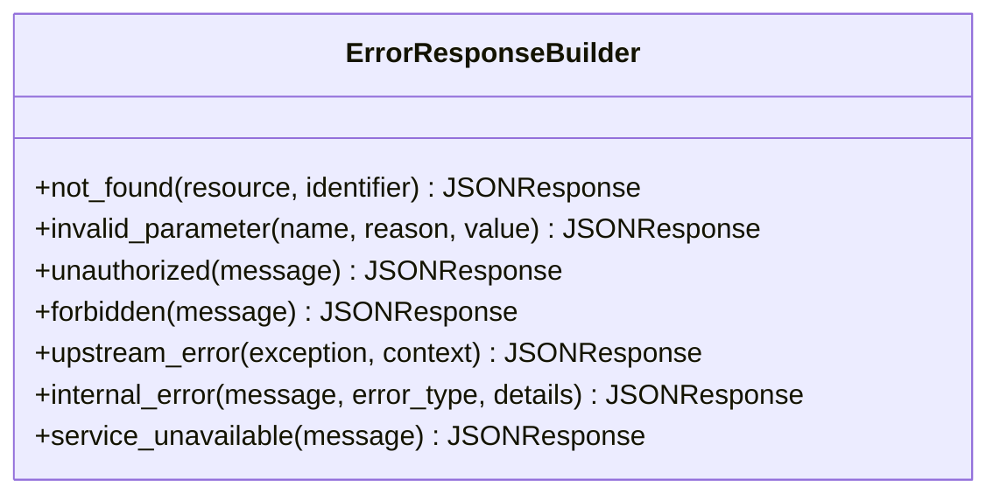
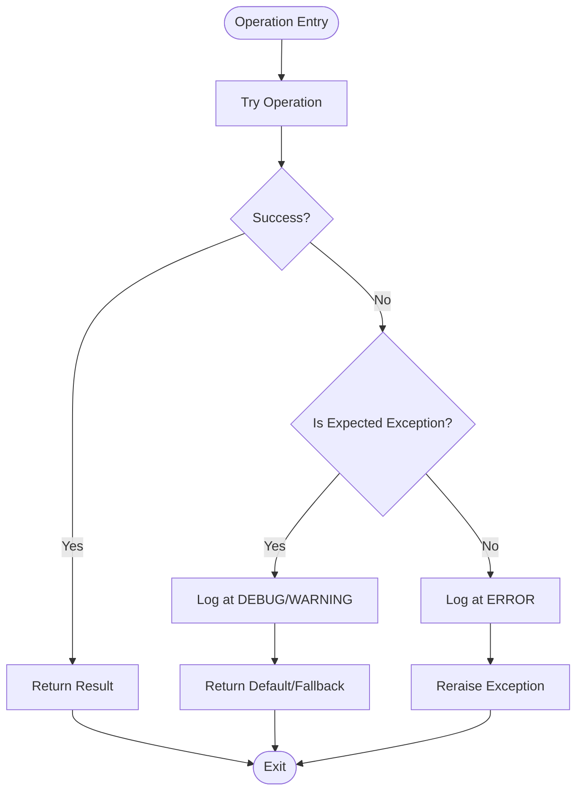
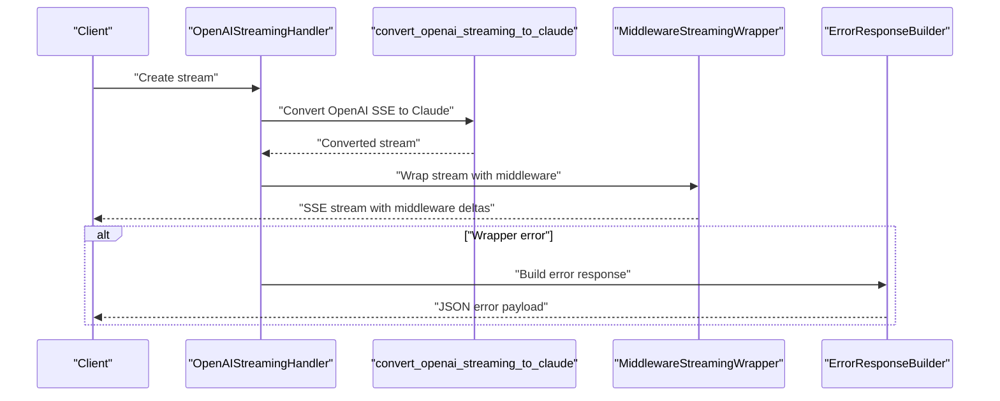
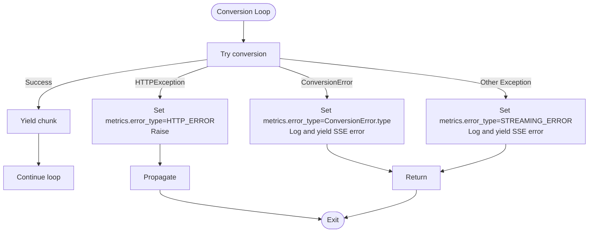
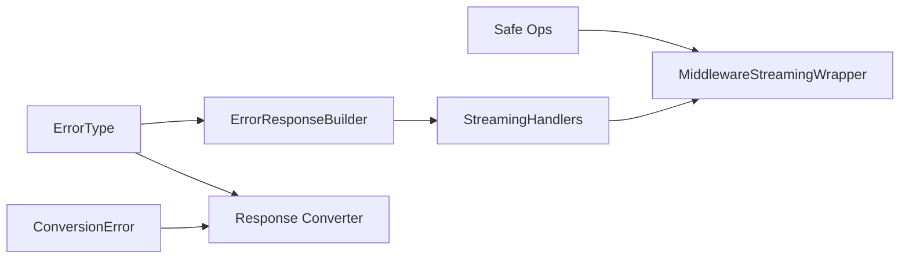

# Error Handling Guide

<cite>
**Referenced Files in This Document**
- [error-handling-guide.md](file://docs/error-handling-guide.md)
- [error_handling.py](file://src/api/services/error_handling.py)
- [errors.py](file://src/conversion/errors.py)
- [error_types.py](file://src/core/error_types.py)
- [decorators.py](file://src/core/safe_ops/decorators.py)
- [parsers.py](file://src/core/safe_ops/parsers.py)
- [context.py](file://src/core/safe_ops/context.py)
- [streaming_handlers.py](file://src/api/services/streaming_handlers.py)
- [middleware_integration.py](file://src/api/middleware_integration.py)
- [response_converter.py](file://src/conversion/response_converter.py)
- [test_openai_streaming_error_handling.py](file://tests/unit/test_openai_streaming_error_handling.py)
</cite>

## Table of Contents
1. [Introduction](#introduction)
2. [Project Structure](#project-structure)
3. [Core Components](#core-components)
4. [Architecture Overview](#architecture-overview)
5. [Detailed Component Analysis](#detailed-component-analysis)
6. [Dependency Analysis](#dependency-analysis)
7. [Performance Considerations](#performance-considerations)
8. [Troubleshooting Guide](#troubleshooting-guide)
9. [Conclusion](#conclusion)

## Introduction
This guide documents the error handling architecture and patterns used across the Vandamme Proxy codebase. It focuses on:
- Consistent error response construction
- Structured error types for metrics and diagnostics
- Safe parsing utilities and controlled exception handling
- Streaming error propagation and recovery
- Middleware-aware error handling for SSE streams

The goal is to help developers write robust, observable, and maintainable error handling code that follows established patterns in the project.

## Project Structure
The error handling ecosystem spans several modules:
- API services: centralized error response builders and streaming error handling
- Core error types: strongly typed categories for metrics and diagnostics
- Safe operations: reusable utilities for safe parsing and controlled exception handling
- Conversion layer: structured exceptions for conversion and streaming scenarios
- Middleware integration: SSE-aware error handling and streaming wrappers
- Tests: verification of error behaviors and stability

**Diagram sources**
- [error_handling.py](file://src/api/services/error_handling.py#L1-L299)
- [error_types.py](file://src/core/error_types.py#L1-L48)
- [decorators.py](file://src/core/safe_ops/decorators.py#L1-L98)
- [parsers.py](file://src/core/safe_ops/parsers.py#L1-L62)
- [context.py](file://src/core/safe_ops/context.py#L1-L80)
- [errors.py](file://src/conversion/errors.py#L1-L38)
- [response_converter.py](file://src/conversion/response_converter.py#L394-L430)
- [middleware_integration.py](file://src/api/middleware_integration.py#L245-L330)
- [streaming_handlers.py](file://src/api/services/streaming_handlers.py#L1-L223)

**Section sources**
- [error-handling-guide.md](file://docs/error-handling-guide.md#L1-L217)
- [error_handling.py](file://src/api/services/error_handling.py#L1-L299)
- [error_types.py](file://src/core/error_types.py#L1-L48)
- [decorators.py](file://src/core/safe_ops/decorators.py#L1-L98)
- [parsers.py](file://src/core/safe_ops/parsers.py#L1-L62)
- [context.py](file://src/core/safe_ops/context.py#L1-L80)
- [errors.py](file://src/conversion/errors.py#L1-L38)
- [middleware_integration.py](file://src/api/middleware_integration.py#L1-L330)
- [response_converter.py](file://src/conversion/response_converter.py#L394-L430)
- [streaming_handlers.py](file://src/api/services/streaming_handlers.py#L1-L223)

## Core Components
- Error response builder: Provides consistent JSON error payloads with typed error categories and appropriate HTTP status codes.
- Error type enumeration: Centralized categorization for metrics, SSE error events, and reporting.
- Safe operations: Utilities for safe JSON parsing, optional operations, and controlled exception handling with logging.
- Conversion errors: Structured exceptions for conversion and streaming scenarios with stable error types.
- Streaming handlers: Factory-based handlers that orchestrate upstream calls, error handling, and response building.
- Middleware integration: SSE-aware wrapper that parses and routes chunks to middleware, with graceful handling of malformed events.

**Section sources**
- [error_handling.py](file://src/api/services/error_handling.py#L19-L299)
- [error_types.py](file://src/core/error_types.py#L9-L48)
- [parsers.py](file://src/core/safe_ops/parsers.py#L21-L62)
- [context.py](file://src/core/safe_ops/context.py#L15-L80)
- [errors.py](file://src/conversion/errors.py#L7-L38)
- [streaming_handlers.py](file://src/api/services/streaming_handlers.py#L33-L223)
- [middleware_integration.py](file://src/api/middleware_integration.py#L245-L330)

## Architecture Overview
The error handling architecture follows a layered approach:
- API layer: constructs error responses and finalizes metrics on streaming failures.
- Conversion layer: raises structured exceptions that can be mapped to client-visible errors.
- Safe ops: provides utilities to replace broad exception handling with specific, logged fallbacks.
- Middleware: processes streaming deltas and handles malformed SSE gracefully.
- Metrics: tracks error types and durations for observability.

**Diagram sources**
- [streaming_handlers.py](file://src/api/services/streaming_handlers.py#L78-L117)
- [error_handling.py](file://src/api/services/error_handling.py#L222-L299)
- [response_converter.py](file://src/conversion/response_converter.py#L394-L430)

## Detailed Component Analysis

### Error Response Builder
The builder centralizes error response construction with:
- Typed error categories for consistent client consumption
- Automatic HTTP status selection based on error semantics
- Upstream error classification and timeout detection
- Internal error construction with optional details

**Diagram sources**
- [error_handling.py](file://src/api/services/error_handling.py#L19-L219)

**Section sources**
- [error_handling.py](file://src/api/services/error_handling.py#L19-L219)

### Error Types Enumeration
The ErrorType enum defines categories used across:
- Request metrics error_type fields
- SSE error events
- Aggregation and reporting

Categories include lifecycle errors, HTTP/API errors, authentication/rate limiting, streaming errors, usage warnings, and unexpected errors.

**Section sources**
- [error_types.py](file://src/core/error_types.py#L9-L48)

### Safe Operations Utilities
Safe operations provide three reusable patterns:
- Safe JSON parsing: catches only expected JSON parse exceptions and logs at configurable levels.
- Suppress-and-log context manager: replaces bare except blocks with explicit logging and suppression.
- Decorators: log-and-return-default and log-and-reraise for controlled exception handling.

**Diagram sources**
- [parsers.py](file://src/core/safe_ops/parsers.py#L21-L62)
- [context.py](file://src/core/safe_ops/context.py#L15-L80)
- [decorators.py](file://src/core/safe_ops/decorators.py#L16-L98)

**Section sources**
- [parsers.py](file://src/core/safe_ops/parsers.py#L1-L62)
- [context.py](file://src/core/safe_ops/context.py#L1-L80)
- [decorators.py](file://src/core/safe_ops/decorators.py#L1-L98)

### Conversion Errors
Structured exceptions for conversion and streaming:
- ConversionError: base class with message, error_type, and context
- SSEParseError: structured SSE parsing failures
- StreamingCancelledError: cancellation during streaming
- StreamingInternalError: generic streaming errors

These enable deterministic logging, stable client-visible payloads, and optional attachment to request metrics.

**Section sources**
- [errors.py](file://src/conversion/errors.py#L7-L38)

### Streaming Handlers and Middleware Integration
Streaming handlers encapsulate provider-specific logic:
- AnthropicStreamingHandler: direct passthrough for Anthropic-compatible APIs
- OpenAIStreamingHandler: conversion to Claude format with optional middleware application

MiddlewareStreamingWrapper parses SSE chunks and feeds deltas to middleware, logging malformed events at debug level.

**Diagram sources**
- [streaming_handlers.py](file://src/api/services/streaming_handlers.py#L119-L207)
- [middleware_integration.py](file://src/api/middleware_integration.py#L245-L330)

**Section sources**
- [streaming_handlers.py](file://src/api/services/streaming_handlers.py#L33-L223)
- [middleware_integration.py](file://src/api/middleware_integration.py#L245-L330)

### Response Conversion Error Handling
The conversion layer handles exceptions with:
- HTTPException: logs and propagates as non-cancellation error
- ConversionError: updates metrics, logs, yields structured SSE error, and returns
- Other exceptions: logs and yields generic SSE error

**Diagram sources**
- [response_converter.py](file://src/conversion/response_converter.py#L394-L430)

**Section sources**
- [response_converter.py](file://src/conversion/response_converter.py#L394-L430)

## Dependency Analysis
Error handling components depend on each other as follows:
- API error handling depends on ErrorType for categorization
- Streaming handlers depend on error builders and middleware integration
- Middleware integration depends on safe parsing utilities for SSE
- Conversion errors integrate with metrics and response conversion logic

**Diagram sources**
- [error_types.py](file://src/core/error_types.py#L9-L48)
- [error_handling.py](file://src/api/services/error_handling.py#L14-L16)
- [middleware_integration.py](file://src/api/middleware_integration.py#L19-L24)
- [response_converter.py](file://src/conversion/response_converter.py#L405-L411)
- [streaming_handlers.py](file://src/api/services/streaming_handlers.py#L16-L28)

**Section sources**
- [error_types.py](file://src/core/error_types.py#L9-L48)
- [error_handling.py](file://src/api/services/error_handling.py#L14-L16)
- [middleware_integration.py](file://src/api/middleware_integration.py#L19-L24)
- [response_converter.py](file://src/conversion/response_converter.py#L405-L411)
- [streaming_handlers.py](file://src/api/services/streaming_handlers.py#L16-L28)

## Performance Considerations
- Prefer specific exception handling over broad catch-all blocks to avoid masking unexpected issues.
- Use safe parsing utilities to minimize overhead while ensuring robustness.
- Log at appropriate levels to reduce noise in production logs while preserving diagnostic value.
- Keep streaming error handling lightweight to avoid impacting throughput.

## Troubleshooting Guide
Common scenarios and resolutions:
- SSE parsing failures: Use safe parsing utilities and log at debug level; malformed events are tolerated.
- Upstream timeouts: ErrorResponseBuilder detects timeout exceptions and returns appropriate status codes.
- Streaming cancellations: Preserve original exception types for upstream handlers while logging for visibility.
- Conversion errors: Ensure structured exceptions are raised with stable error types for client visibility.
- Middleware errors: Log and propagate to avoid corrupting the stream; verify SSE chunk parsing.

Verification examples:
- SSE parse error type and message stability
- Error response builder coverage for various error categories
- Streaming error handling in conversion layer

**Section sources**
- [error-handling-guide.md](file://docs/error-handling-guide.md#L111-L131)
- [test_openai_streaming_error_handling.py](file://tests/unit/test_openai_streaming_error_handling.py#L6-L11)
- [response_converter.py](file://src/conversion/response_converter.py#L405-L411)

## Conclusion
The Vandamme Proxy implements a cohesive error handling strategy:
- Centralized error response construction with typed categories
- Structured error types for metrics and diagnostics
- Safe operations replacing broad exception handling with specific, logged fallbacks
- Middleware-aware SSE handling with graceful degradation
- Conversion layer raising structured exceptions for stable client-visible errors

Following these patterns ensures consistent, observable, and maintainable error handling across the system.