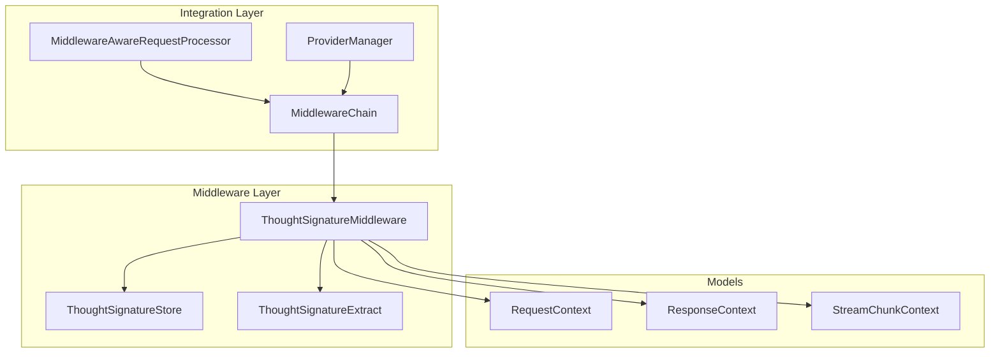
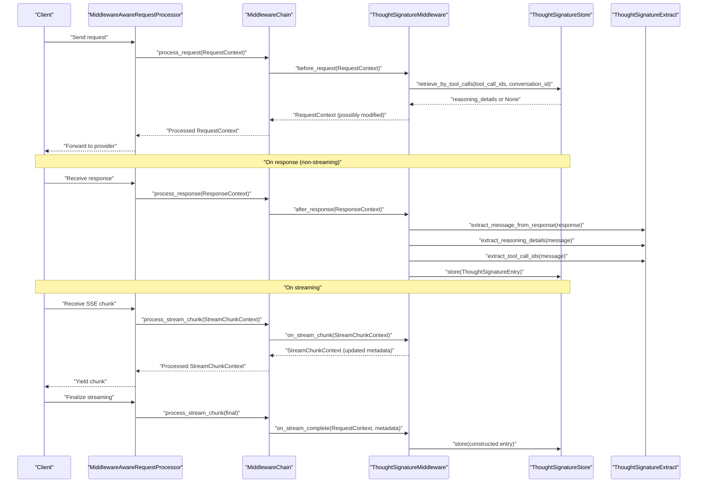
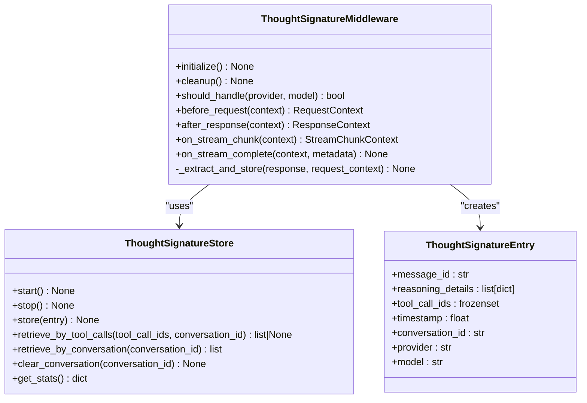
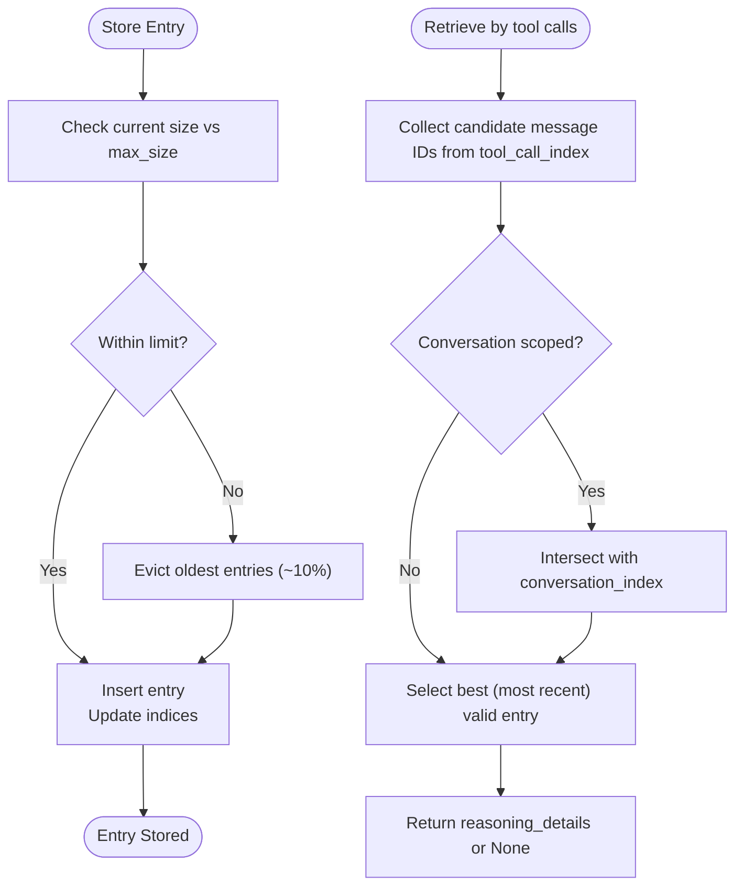
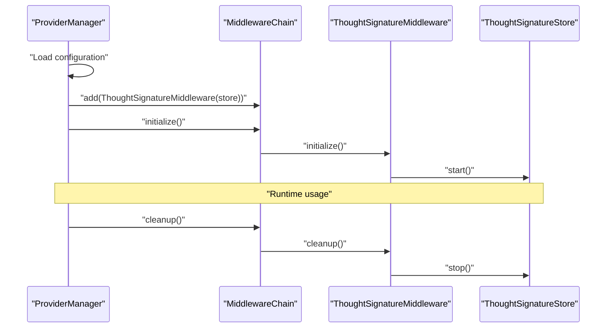
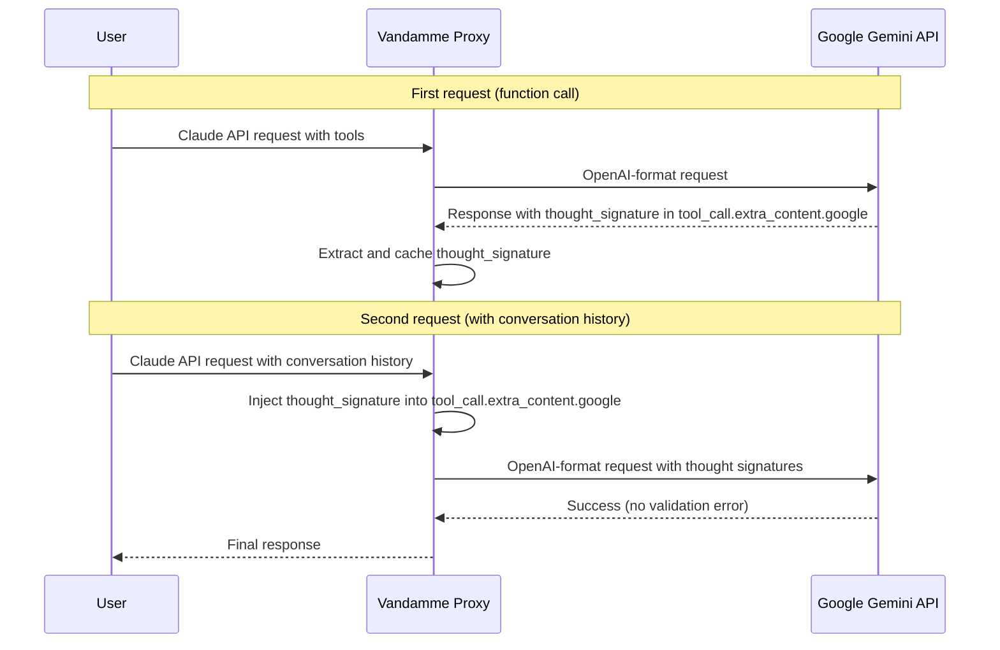

# Thought Signature Middleware

<cite>
**Referenced Files in This Document**
- [thought_signature.py](file://src/middleware/thought_signature.py)
- [thought_signature_store.py](file://src/middleware/thought_signature_store.py)
- [thought_signature_extract.py](file://src/middleware/thought_signature_extract.py)
- [base.py](file://src/middleware/base.py)
- [middleware_integration.py](file://src/api/middleware_integration.py)
- [provider_manager.py](file://src/core/provider_manager.py)
- [test_thought_signature.py](file://tests/middleware/test_thought_signature.py)
</cite>

## Table of Contents
1. [Introduction](#introduction)
2. [Project Structure](#project-structure)
3. [Core Components](#core-components)
4. [Architecture Overview](#architecture-overview)
5. [Detailed Component Analysis](#detailed-component-analysis)
6. [Dependency Analysis](#dependency-analysis)
7. [Performance Considerations](#performance-considerations)
8. [Troubleshooting Guide](#troubleshooting-guide)
9. [Conclusion](#conclusion)

## Introduction
This document explains the Thought Signature Middleware feature designed for Google Gemini models. It enables seamless function calling across multi-turn conversations by persisting thought signatures extracted from model responses and injecting them back into tool calls in subsequent requests. The middleware supports both non-streaming and streaming responses, accumulating partial data during streaming and finalizing storage upon completion.

The middleware uses **Google's OpenAI-compatible format** for thought signatures, injecting them as `extra_content.google.thought_signature` on each tool_call rather than at the message level. This ensures compatibility with OpenAI-format proxies and direct Google API access.

The middleware is provider-agnostic in its interface but activates automatically for Gemini-related models. It relies on a lightweight in-memory store with TTL-based eviction and conversation-scoped indexing to ensure correctness and performance.

## Project Structure
The Thought Signature Middleware consists of three primary modules:
- ThoughtSignatureMiddleware: Orchestrates extraction, injection, and streaming handling.
- ThoughtSignatureStore: Persistent cache for reasoning details keyed by tool call IDs and conversation ID.
- ThoughtSignatureExtract: Utility functions to normalize response shapes and extract required fields.

These modules integrate with the broader middleware chain and are initialized conditionally based on configuration.



**Diagram sources**
- [thought_signature.py](file://src/middleware/thought_signature.py#L31-L150)
- [thought_signature_store.py](file://src/middleware/thought_signature_store.py#L22-L194)
- [thought_signature_extract.py](file://src/middleware/thought_signature_extract.py#L6-L48)
- [base.py](file://src/middleware/base.py#L22-L92)
- [middleware_integration.py](file://src/api/middleware_integration.py#L26-L51)
- [provider_manager.py](file://src/core/provider_manager.py#L113-L133)

**Section sources**
- [thought_signature.py](file://src/middleware/thought_signature.py#L1-L150)
- [thought_signature_store.py](file://src/middleware/thought_signature_store.py#L1-L194)
- [thought_signature_extract.py](file://src/middleware/thought_signature_extract.py#L1-L48)
- [base.py](file://src/middleware/base.py#L1-L398)
- [middleware_integration.py](file://src/api/middleware_integration.py#L1-L297)
- [provider_manager.py](file://src/core/provider_manager.py#L113-L133)

## Core Components
- ThoughtSignatureMiddleware
  - Determines whether to handle a request based on model name (Gemini).
  - Injects reasoning_details into assistant messages that contain tool_calls.
  - Extracts reasoning_details and tool_call_ids from non-streaming responses.
  - Accumulates reasoning_details and tool_call_ids from streaming chunks and finalizes storage on completion.
- ThoughtSignatureStore
  - Stores ThoughtSignatureEntry objects with TTL and eviction policies.
  - Indexes entries by tool_call_ids and conversation_id for fast retrieval.
  - Provides retrieval by tool call set (any-match semantics) and conversation.
- ThoughtSignatureExtract
  - Normalizes diverse response shapes to a unified message structure.
  - Extracts reasoning_details and tool_call_ids safely, handling malformed inputs.

Key behaviors:
- Non-streaming: after_response triggers extraction and storage.
- Streaming: on_stream_chunk accumulates reasoning_details and tool_call_ids; on_stream_complete constructs a mock response and triggers extraction.
- Injection: before_request scans messages for assistant tool_calls and injects stored reasoning_details scoped to the conversation.

**Section sources**
- [thought_signature.py](file://src/middleware/thought_signature.py#L31-L150)
- [thought_signature_store.py](file://src/middleware/thought_signature_store.py#L22-L194)
- [thought_signature_extract.py](file://src/middleware/thought_signature_extract.py#L6-L48)

## Architecture Overview
The middleware participates in the middleware chain managed by MiddlewareChain. It is conditionally added by ProviderManager when thought signature support is enabled and by MiddlewareAwareRequestProcessor for Claude integration. ThoughtSignatureMiddleware interacts with ThoughtSignatureStore for persistence and ThoughtSignatureExtract for parsing.



**Diagram sources**
- [middleware_integration.py](file://src/api/middleware_integration.py#L53-L183)
- [base.py](file://src/middleware/base.py#L253-L397)
- [thought_signature.py](file://src/middleware/thought_signature.py#L56-L150)
- [thought_signature_store.py](file://src/middleware/thought_signature_store.py#L53-L194)
- [thought_signature_extract.py](file://src/middleware/thought_signature_extract.py#L6-L48)

## Detailed Component Analysis

### ThoughtSignatureMiddleware
Responsibilities:
- Provider/model selection: should_handle checks if the model name contains "gemini".
- Request injection: before_request locates assistant messages with tool_calls, retrieves matching reasoning_details from the store, and injects them into the message.
- Response extraction: after_response extracts reasoning_details and tool_call_ids from non-streaming responses and persists them.
- Streaming handling: on_stream_chunk accumulates reasoning_details and tool_call_ids; on_stream_complete finalizes storage using a mock response constructed from accumulated metadata.

Implementation highlights:
- Injection logic preserves message identity by copying and replacing only when reasoning_details are found.
- Extraction uses normalized message parsing and validates presence of both reasoning_details and tool_call_ids before storing.
- Streaming uses accumulated_metadata to collect partial data across chunks and reconstructs a minimal response for extraction.



**Diagram sources**
- [thought_signature.py](file://src/middleware/thought_signature.py#L31-L150)
- [thought_signature_store.py](file://src/middleware/thought_signature_store.py#L11-L194)

**Section sources**
- [thought_signature.py](file://src/middleware/thought_signature.py#L31-L150)

### ThoughtSignatureStore
Responsibilities:
- Persist ThoughtSignatureEntry with TTL-based expiration and periodic cleanup.
- Index entries by tool_call_ids and conversation_id for efficient retrieval.
- Evict oldest entries when capacity is exceeded.
- Provide retrieval by tool call set (any-match semantics) and conversation.

Key design decisions:
- Frozen dataclass for immutability and fast hashing.
- Lock-based synchronization for thread-safety under concurrent access.
- TTL-based cleanup loop runs independently to remove expired entries.
- Max-size eviction removes ~10% of oldest entries to keep memory bounded.



**Diagram sources**
- [thought_signature_store.py](file://src/middleware/thought_signature_store.py#L53-L194)

**Section sources**
- [thought_signature_store.py](file://src/middleware/thought_signature_store.py#L22-L194)

### ThoughtSignatureExtract
Responsibilities:
- Normalize response shapes to a unified message structure:
  - OpenAI-style: {"choices": [{"message": {...}}]}
  - Direct wrapper: {"message": {...}}
  - Flat dict: {...}
- Extract reasoning_details as a list of dicts.
- Extract tool_call_ids as a set of strings from tool_calls.

Robustness:
- Gracefully handles missing or malformed fields by returning safe defaults.

**Section sources**
- [thought_signature_extract.py](file://src/middleware/thought_signature_extract.py#L6-L48)

### Integration Points
- MiddlewareChain: Executes middleware in order and manages lifecycle.
- MiddlewareAwareRequestProcessor: Integrates middleware into API endpoints and SSE streaming.
- ProviderManager: Conditionally adds ThoughtSignatureMiddleware based on configuration flags and settings.



**Diagram sources**
- [provider_manager.py](file://src/core/provider_manager.py#L113-L133)
- [middleware_integration.py](file://src/api/middleware_integration.py#L38-L51)
- [thought_signature.py](file://src/middleware/thought_signature.py#L42-L48)

**Section sources**
- [provider_manager.py](file://src/core/provider_manager.py#L113-L133)
- [middleware_integration.py](file://src/api/middleware_integration.py#L38-L51)
- [base.py](file://src/middleware/base.py#L191-L397)

## Dependency Analysis
- ThoughtSignatureMiddleware depends on:
  - ThoughtSignatureStore for persistence and retrieval.
  - ThoughtSignatureExtract for parsing response messages.
  - Middleware base classes (RequestContext, ResponseContext, StreamChunkContext) for context passing.
- ThoughtSignatureStore depends on:
  - asyncio for asynchronous operations and cleanup loop.
  - dataclasses for immutable entry representation.
  - threading locks for safe concurrent access.
- Integration layers:
  - MiddlewareChain orchestrates middleware execution.
  - MiddlewareAwareRequestProcessor wraps API endpoints to apply middleware.
  - ProviderManager conditionally registers middleware based on configuration.

Potential circular dependencies:
- None observed; middleware is a leaf consumer of base contexts and utilities.

External dependencies:
- No external packages are imported by these modules; all dependencies are internal.

**Section sources**
- [thought_signature.py](file://src/middleware/thought_signature.py#L20-L26)
- [thought_signature_store.py](file://src/middleware/thought_signature_store.py#L3-L8)
- [base.py](file://src/middleware/base.py#L13-L18)
- [middleware_integration.py](file://src/api/middleware_integration.py#L19-L21)
- [provider_manager.py](file://src/core/provider_manager.py#L120-L131)

## Performance Considerations
- Memory footprint:
  - Store maintains fixed-size indices and enforces max_size eviction. Use configuration to balance memory and accuracy.
- Throughput:
  - Retrieval by tool calls uses set intersection across indices; performance scales with number of tool call IDs and index size.
- Latency:
  - Injection occurs in before_request; extraction in after_response/on_stream_complete; streaming accumulation is incremental.
- Cleanup:
  - Background cleanup loop runs at configurable intervals; tune cleanup_interval to balance resource usage and freshness.

Recommendations:
- Adjust TTL and max_size according to conversation length and tool call frequency.
- Monitor store statistics to detect cache pressure and adjust parameters accordingly.

[No sources needed since this section provides general guidance]

## OpenAI-Compatible Format

The middleware implements Google's OpenAI compatibility mode for thought signatures as specified in [Google's Thought Signature documentation](https://ai.google.dev/gemini-api/docs/thought-signatures).

### Injection Format

When injecting thought signatures into requests, the middleware uses the following format:

```json
{
  "tool_calls": [
    {
      "id": "call_abc123",
      "type": "function",
      "function": {"name": "get_weather", "arguments": "{}"},
      "extra_content": {
        "google": {
          "thought_signature": "signature_string_here"
        }
      }
    }
  ]
}
```

**Key points:**
- Thought signatures are injected on each `tool_call` object, not at the message level
- The `extra_content.google.thought_signature` path follows Google's OpenAI compatibility specification
- For parallel function calls, only the first tool_call receives the thought signature (per Google's specification)
- For sequential (multi-step) function calls, each tool_call gets its own thought signature

### Extraction Format

The middleware extracts thought signatures from responses in two formats:

1. **OpenAI format** (priority): Extracts from `tool_call.extra_content.google.thought_signature`
2. **Legacy format** (fallback): Extracts from message-level `reasoning_details` field

This dual-format support ensures backward compatibility while implementing the correct OpenAI-compatible format.

### Example Flow



**Section sources**
- [thought_signature.py](file://src/middleware/thought_signature.py#L56-L121)
- [thought_signature_extract.py](file://src/middleware/thought_signature_extract.py#L30-L84)

## Troubleshooting Guide

Common issues and resolutions:
- Malformed responses
  - Symptom: Missing reasoning_details or tool_calls in response.
  - Resolution: The middleware gracefully skips extraction when required fields are absent. Verify provider response shape and ensure tool calls are present.
  - Evidence: Tests demonstrate handling of missing fields without errors.
- Partial tool call sets
  - Symptom: Assistant message lacks tool_call_ids or only partial IDs are present.
  - Resolution: The store supports any-match semantics and returns the most recent valid entry among candidates. Ensure tool_call_ids are consistently present in responses.
- Conversation scoping
  - Symptom: Reasoning details appear in unrelated conversations.
  - Resolution: The store scopes retrieval by conversation_id; ensure conversation_id is set in RequestContext for both extraction and injection.
- Streaming gaps
  - Symptom: Streaming chunks do not accumulate reasoning_details.
  - Resolution: Verify that SSE chunks contain OpenAI-style deltas with reasoning_details and tool_calls; ensure on_stream_chunk updates accumulated_metadata and on_stream_complete is invoked.
- Concurrency and race conditions
  - Symptom: Inconsistent retrieval or storage under load.
  - Resolution: The store uses a lock for thread-safety; ensure middleware is initialized and not prematurely stopped.

Validation references:
- Tests cover malformed data handling, streaming accumulation, and retrieval by tool call sets and conversation.
- Contract tests verify streaming hooks persist and inject thought signatures correctly.

**Section sources**
- [test_thought_signature.py](file://tests/middleware/test_thought_signature.py#L399-L430)
- [test_thought_signature.py](file://tests/middleware/test_thought_signature.py#L331-L368)
- [test_thought_signature.py](file://tests/middleware/test_thought_signature.py#L80-L84)
- [test_thought_signature.py](file://tests/middleware/test_thought_signature.py#L109-L130)

## Conclusion
The Thought Signature Middleware provides a robust mechanism to maintain reasoning details across multi-turn Gemini conversations. By extracting and persisting reasoning_details alongside tool_call_ids, it ensures that downstream steps retain context even when upstream responses are fragmented or lack explicit reasoning artifacts. The middleware’s design emphasizes reliability, concurrency safety, and configurability, integrating seamlessly with the middleware chain and API processing layers.

[No sources needed since this section summarizes without analyzing specific files]