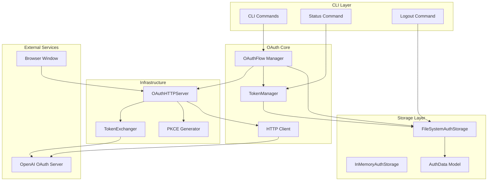
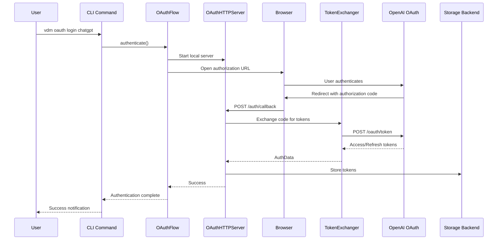
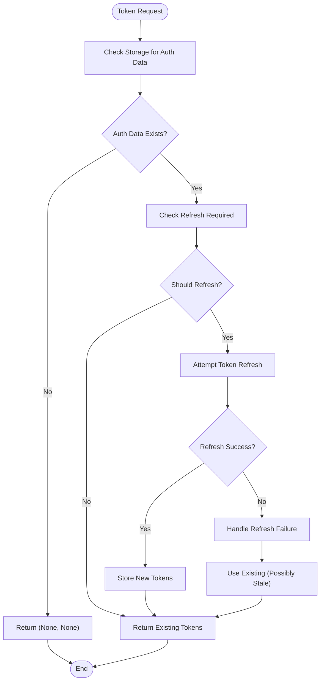
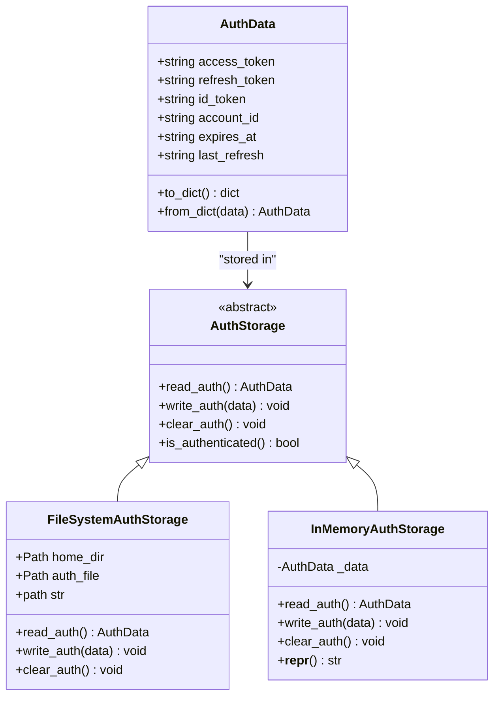
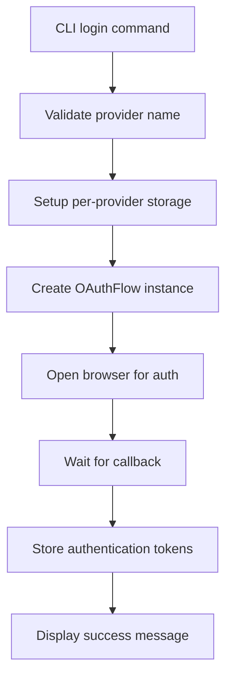
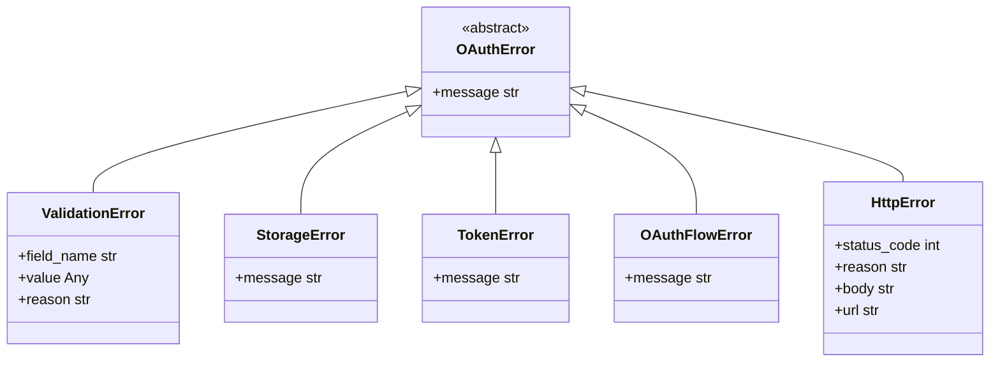

# OAuth Authentication System

<cite>
**Referenced Files in This Document**
- [oauth.py](file://src/core/oauth/oauth.py)
- [constants.py](file://src/core/oauth/constants.py)
- [tokens.py](file://src/core/oauth/tokens.py)
- [callback_server.py](file://src/core/oauth/callback_server.py)
- [token_exchanger.py](file://src/core/oauth/token_exchanger.py)
- [storage/__init__.py](file://src/core/oauth/storage/__init__.py)
- [file_storage.py](file://src/core/oauth/storage/file_storage.py)
- [memory_storage.py](file://src/core/oauth/storage/memory_storage.py)
- [pkce.py](file://src/core/oauth/pkce.py)
- [jwt.py](file://src/core/oauth/jwt.py)
- [http_client.py](file://src/core/oauth/http_client.py)
- [oauth_client_mixin.py](file://src/core/oauth_client_mixin.py)
- [oauth.py](file://src/cli/commands/oauth.py)
- [validation.py](file://src/core/oauth/validation.py)
</cite>

## Table of Contents
1. [Introduction](#introduction)
2. [System Architecture](#system-architecture)
3. [Core Components](#core-components)
4. [OAuth Flow Implementation](#oauth-flow-implementation)
5. [Token Management](#token-management)
6. [Storage Abstraction](#storage-abstraction)
7. [Security Features](#security-features)
8. [CLI Integration](#cli-integration)
9. [Error Handling](#error-handling)
10. [Performance Considerations](#performance-considerations)
11. [Troubleshooting Guide](#troubleshooting-guide)
12. [Conclusion](#conclusion)

## Introduction

The OAuth Authentication System in Vandamme Proxy provides a comprehensive framework for implementing OAuth 2.0 + PKCE authentication specifically designed for ChatGPT/OpenAI services. This system enables secure authentication flows, token management, and seamless integration with the proxy's API clients. The implementation follows industry standards and best practices for OAuth security, including PKCE (Proof Key for Code Exchange) to prevent authorization code interception attacks.

The system is built with modularity in mind, allowing for different storage backends, configurable timeouts, and extensible authentication flows. It supports both interactive browser-based authentication and programmatic token management for automated environments.

## System Architecture

The OAuth authentication system follows a layered architecture with clear separation of concerns:

**Diagram sources**
- [oauth.py](file://src/core/oauth/oauth.py#L57-L176)
- [callback_server.py](file://src/core/oauth/callback_server.py#L41-L164)
- [tokens.py](file://src/core/oauth/tokens.py#L32-L117)
- [storage/file_storage.py](file://src/core/oauth/storage/file_storage.py#L19-L101)

The architecture demonstrates clear separation between:
- **CLI Integration**: User-facing commands for authentication management
- **Core OAuth Logic**: Flow orchestration and token management
- **Infrastructure Layer**: HTTP server handling and token exchange
- **Storage Abstraction**: Pluggable storage backends
- **External Dependencies**: OpenAI OAuth services and browser interactions

## Core Components

### OAuthFlow Manager

The [`OAuthFlow`](file://src/core/oauth/oauth.py#L57-L176) class serves as the primary interface for orchestrating the entire OAuth authentication process. It manages the complete flow from initiating the authentication to storing the resulting tokens.

Key responsibilities include:
- Creating and managing the local callback HTTP server
- Generating authorization URLs with PKCE parameters
- Handling browser automation and user interaction
- Coordinating token exchange and storage
- Managing timeouts and graceful shutdown

### TokenManager

The [`TokenManager`](file://src/core/oauth/tokens.py#L32-L117) provides sophisticated token lifecycle management with automatic refresh capabilities. It ensures applications always have valid access tokens without manual intervention.

Core features:
- Automatic token refresh before expiration
- Fallback refresh mechanisms when expiry information is unavailable
- Integration with storage backends for persistence
- Error handling and recovery strategies

### HTTP Client Infrastructure

The HTTP client system provides a robust foundation for OAuth token exchanges and API communications. It includes retry logic, structured logging, and error handling for network operations.

**Section sources**
- [oauth.py](file://src/core/oauth/oauth.py#L57-L176)
- [tokens.py](file://src/core/oauth/tokens.py#L32-L117)
- [http_client.py](file://src/core/oauth/http_client.py#L235-L342)

## OAuth Flow Implementation

The OAuth authentication flow follows the standardized OAuth 2.0 Authorization Code flow enhanced with PKCE security:

**Diagram sources**
- [oauth.py](file://src/core/oauth/oauth.py#L97-L157)
- [callback_server.py](file://src/core/oauth/callback_server.py#L166-L227)
- [token_exchanger.py](file://src/core/oauth/token_exchanger.py#L55-L111)

The flow implements several security measures:
- **PKCE Implementation**: Cryptographically secure code challenge and verifier
- **State Parameter Protection**: Prevents CSRF attacks
- **Local Callback Server**: Handles redirects safely on localhost
- **Automatic Token Refresh**: Maintains session continuity

**Section sources**
- [callback_server.py](file://src/core/oauth/callback_server.py#L116-L133)
- [pkce.py](file://src/core/oauth/pkce.py#L33-L70)

## Token Management

### Token Lifecycle

The token management system implements a comprehensive lifecycle that ensures continuous authentication:

**Diagram sources**
- [tokens.py](file://src/core/oauth/tokens.py#L79-L117)
- [tokens.py](file://src/core/oauth/tokens.py#L127-L171)

### Refresh Strategy

The system employs a dual-layer refresh strategy:

1. **Expiry-Based Refresh**: Uses JWT expiry timestamps to refresh tokens before they expire
2. **Fallback Refresh**: Implements time-based refresh when expiry information is unavailable

The refresh threshold is set to 5 minutes before expiry, providing a safety buffer for token validity.

**Section sources**
- [tokens.py](file://src/core/oauth/tokens.py#L127-L171)
- [constants.py](file://src/core/oauth/constants.py#L56-L71)

## Storage Abstraction

The storage system provides a flexible abstraction layer supporting multiple storage backends:

### AuthData Model

The [`AuthData`](file://src/core/oauth/storage/__init__.py#L32-L70) dataclass encapsulates all authentication information with built-in validation:

**Diagram sources**
- [storage/__init__.py](file://src/core/oauth/storage/__init__.py#L32-L131)
- [storage/file_storage.py](file://src/core/oauth/storage/file_storage.py#L19-L101)
- [storage/memory_storage.py](file://src/core/oauth/storage/memory_storage.py#L12-L44)

### Storage Backends

**FileSystemAuthStorage**: Persists authentication data to JSON files with secure file permissions (0600). Supports configurable home directories and automatic directory creation.

**InMemoryAuthStorage**: Provides ephemeral storage for testing and temporary sessions without file I/O overhead.

**Section sources**
- [storage/__init__.py](file://src/core/oauth/storage/__init__.py#L133-L182)
- [storage/file_storage.py](file://src/core/oauth/storage/file_storage.py#L19-L101)

## Security Features

### PKCE Implementation

The system implements PKCE (Proof Key for Code Exchange) as required by modern OAuth security standards:

- **Code Verifier Generation**: Cryptographically secure random string (43-128 characters)
- **SHA-256 Challenge Method**: Industry-standard hashing algorithm
- **Base64url Encoding**: Safe URL encoding without padding

### JWT Processing

The JWT processing system extracts essential claims without signature verification, focusing on the account ID and token metadata:

- **Multi-format Support**: Handles various JWT claim locations
- **Error Handling**: Graceful degradation when claims are unavailable
- **Security Focus**: Extracts only necessary information for authentication

### Transport Security

All communication with OAuth endpoints uses HTTPS, and the system validates URL schemes to prevent insecure connections.

**Section sources**
- [pkce.py](file://src/core/oauth/pkce.py#L33-L70)
- [jwt.py](file://src/core/oauth/jwt.py#L66-L110)
- [validation.py](file://src/core/oauth/validation.py#L152-L183)

## CLI Integration

The CLI provides three primary commands for OAuth management:

### Authentication Flow

The [`login`](file://src/cli/commands/oauth.py#L14-L87) command orchestrates the complete authentication process:

**Diagram sources**
- [oauth.py](file://src/cli/commands/oauth.py#L14-L87)

### Status Checking

The [`status`](file://src/cli/commands/oauth.py#L90-L179) command provides comprehensive authentication status information including account details and token metadata.

### Session Management

The [`logout`](file://src/cli/commands/oauth.py#L182-L245) command removes stored authentication data, supporting clean session management.

**Section sources**
- [oauth.py](file://src/cli/commands/oauth.py#L14-L245)

## Error Handling

The system implements comprehensive error handling across all layers:

### Exception Hierarchy

**Diagram sources**
- [http_client.py](file://src/core/oauth/http_client.py#L87-L116)
- [storage/__init__.py](file://src/core/oauth/storage/__init__.py#L13-L19)

### Error Recovery Strategies

- **Network Failures**: Automatic retry with exponential backoff
- **Token Refresh Failures**: Graceful degradation with warning logs
- **Storage Issues**: Consistent error wrapping for predictable handling
- **Validation Errors**: Descriptive error messages for configuration issues

**Section sources**
- [http_client.py](file://src/core/oauth/http_client.py#L160-L233)
- [tokens.py](file://src/core/oauth/tokens.py#L173-L272)

## Performance Considerations

### Connection Management

The HTTP client implements connection pooling and efficient retry mechanisms to optimize network performance while maintaining reliability.

### Token Caching

The system minimizes unnecessary token exchanges by implementing intelligent caching and refresh strategies, reducing latency for repeated API calls.

### Resource Cleanup

Proper resource cleanup ensures that HTTP servers and file handles are properly closed, preventing resource leaks in long-running applications.

## Troubleshooting Guide

### Common Issues and Solutions

**Authentication Timeout**: Occurs when the browser authentication takes longer than the configured timeout. Increase the timeout setting in the OAuth configuration.

**Storage Permission Errors**: File-based storage may fail due to insufficient permissions. Verify that the storage directory has appropriate write permissions.

**Network Connectivity Issues**: Network errors during token exchange can be resolved by checking internet connectivity and firewall settings.

**Token Expiration Problems**: If tokens expire unexpectedly, check system clock synchronization and network time settings.

### Debugging Tools

The system provides structured logging throughout the authentication flow, enabling detailed debugging of authentication issues and performance monitoring.

**Section sources**
- [http_client.py](file://src/core/oauth/http_client.py#L297-L341)
- [file_storage.py](file://src/core/oauth/storage/file_storage.py#L65-L77)

## Conclusion

The OAuth Authentication System in Vandamme Proxy provides a robust, secure, and user-friendly solution for implementing OAuth 2.0 + PKCE authentication. The system's modular architecture, comprehensive error handling, and flexible storage options make it suitable for various deployment scenarios while maintaining strong security practices.

Key strengths include:
- **Security-First Design**: PKCE implementation and secure token handling
- **Developer Experience**: Clean APIs and comprehensive CLI integration
- **Reliability**: Robust error handling and automatic recovery mechanisms
- **Flexibility**: Pluggable storage backends and configurable behavior
- **Maintainability**: Clear separation of concerns and extensive documentation

The system successfully bridges the gap between complex OAuth specifications and practical implementation needs, providing a solid foundation for secure authentication in proxy applications.
